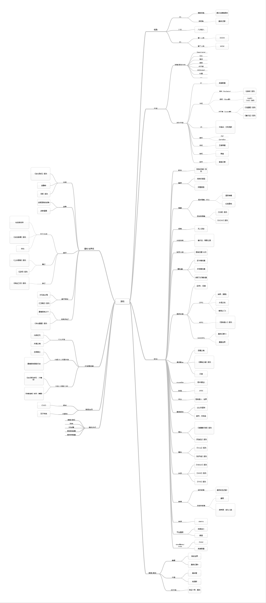

# 游戏分类与热点探索

## 游戏分类

[游戏分类.pdf](./游戏分类.pdf)

## 结合手机游戏市场的下载量与排名等数据，结合游戏分类图，描述游戏市场的热点

> 数据来源：
> - app annie
> - sensor tower
> - 七麦数据
> - [2019年中国游戏产业年度报告 伽马数据](./2019中国游戏产业年度报告首发_国内2330.2亿%20电竞增16.2%%20-%20焦点图新闻%20-%20伽马数据%20唯一官网.pdf)
> - [2019年中国游戏产业报告（摘要版）](./2019中国年度游戏产业报告%20中国音数协工委.pdf)
> - [国产二次元手游观察](https://space.bilibili.com/179948458)

由于安卓手机厂商众多，虽然国外主要采用 Google Play 作为主要的应用下载来源，但由于国内防火墙的存在，加之各大手机厂商也推出了自己手机系统的应用市场，因此统计国内手游的下载和流水比较繁琐和复杂；而对于 ios 系统的设备来说，虽然和 Google Play 一样也有分区设置，但由于 ios 用户的应用来源只能是 APP Store ，因此大大减少了数据统计的复杂性。

由于地区繁多，因此本次主要以手游市场最大最广泛的中国手游市场作为主要参考对象。

根据中国手游下载量和排名的前100数据，个人大致将游戏分为四大类：
- 强社交性手游
- 休闲益智消磨时间类手游
- 二次元手游
- 其他杂七杂八

### 强社交性手游

在中国，免费下载和畅销榜中总能够看到王者荣耀和和平精英位列前茅，这些游戏不仅有这强大资本的宣发推广，还带有浓厚的社交属性，基本上00后乃至90后中，很难找到身边没有不玩上述游戏的人。

这类游戏虽然游戏本体免费，但是带有大量的内购项目，比如角色、皮肤和头像等装饰，除开角色外，这些装饰品大多不会影响游戏的平衡性。

这类手游本身玩法并不会特别复杂，但是对队友有着特别强的依赖，因此十分适合用来社交交友。

并且由于现在手游主流的消费者——年轻一代（90后到10后）——时间的碎片化，一局持续时间不太长的游戏会更加受到他们的喜爱，而强社交性手游的一局时间一般都在10分钟到30分钟之间，非常适合利用下课闲暇、上班摸鱼的碎片时间 + 随时可触的手机平台便能够加深和朋友/同事之间的关系，或者在社区找到新的朋友。

强社交性手游除了在中国十分受欢迎，在其他国家诸如印度和日本也十分受欢迎，日本手游榜单中，荒野行动常年在畅销榜前列，而在疫情爆发的现在，停工停学带来的空闲时间大大增加，导致该类游戏的下载量和游玩时长也大幅度增长，也从侧面反映了人们对社会交往与人际关系发展的不可或缺的需求。

出去常见的 MOBA 和吃鸡类型游戏，该类游戏还包括了 rpg 以及卡牌对战等类型。rpg （角色扮演）类游戏的概念本身并不会带有太多的社交属性，但是由于 MMO 类型 RPG 在10年前中国的繁盛，以及其本身能够承载大量的玩法这样的特性，本体免费能够吸引大量呼朋结伴的玩家，内购则能够在拓展玩法的基础上带来大量的收益。

卡牌对战则是起源于 tcg (Trading Card Game，集换式卡牌游戏)，这类游戏如果本身便是以交换和对战作为基础，因此玩家之间的面对面交流尤为重要，以此为基础衍生出来的卡牌对战手游虽然没有了交换卡片的特点，但是良好的社区交流氛围继承了下来，因此一个较为流行的卡牌对战游戏（比如说炉石）对于社交的依赖必不可少。

还有一些游戏则是客户端游戏的移动化，这些游戏是在原本大体量游戏的基础上进行了画面、系统、数值的简化，以求适配手机的性能，有客户端游戏作为基础，游戏粉丝数量就不会太少，但和前面的游戏类型相比，流水和玩家数量并不会太高，这种游戏的例子有 FIFA 的移动版

### 休闲益智类三消

根据调查来看，该类游戏的受众主要偏向于40~60岁的群众，这个群体由于日常工作的劳累和身体机能的退化，会逐渐偏爱没有华丽画面，不需要严苛操作，尽量避免社交发言的休闲方式。三消类游戏机制简单，但是可玩性并不差，即使没有精美的画面，单纯的分数提升便能带来极大的成就感与获得感，对于处在这个年龄阶段的人来说十分的友好。

这类游戏内购商品并不会太多，一般就是加时/群体消除等能够快速获取分数的道具，可能会带有个性装饰。这类游戏的主要收益一般都在游戏内植入的广告中，通过用户点击该广告获取分成收益，由于用户的群体构成本身会避免消费，以及手机游戏在其中的普及并不广泛，因此该类游戏的流水并不会特别高，但却比较稳定。

### 二次元手游

该类游戏类型覆盖的游戏比较广泛，但这类游戏有2个共同的特点：一是高质量（色气）的二次元立绘以及阵容强大的日本声优，而是深不可测的抽卡（扭蛋）系统。我国的动漫产业深受日本的影响，大部分年轻一代从小就生活在日本动画的环境里，因此这类人群对对应着日本的相关产业发展起来的二次元手游会有着特别的好感；这类人群有着有能力消费、愿意消费、敢消费、消费高的特点，大量的手游公司正是瞄准着这样的目标受众，开发了大量的二次元手游（来噶韭菜）

该种手游包含了许多游戏类型，比如3D动作、策略塔防、回合战斗等，由于手机平台的硬件局限，这些游戏并不能够将自己的玩法拓展精进挖掘，因此会搭配上另一个吸引点用来弥补玩法不足的缺陷，这个吸引点一般会是剧情与搭配的世界观。

这类手游主要的玩法之一就是养成，而养成到天花板的速度则会影响用户的黏性，因此策划会不断推出新的环境和角色，用于提高养成的上限，避免用户感到无聊而流失，但与此相对的，便是玩家与游戏环境（这里的环境不是交流氛围，而是指游戏内的内容与机制）无止境的追逐战，在追逐的过程中，玩家要么选择花费大量时间，亦或是花费金钱（即选择肝或者氪，当然又肝又氪的也有很多），如何保持玩家追逐版本更新的热情，便是这些游戏策划需要细心钻研的事情了，而大多数二次元手游中的矛盾便是玩家与策划之间的冲突。

二次元手游氪金普遍偏贵，因为一开始受到了《乖离性百万亚瑟王》的影响，照搬了日本的充值货币体系，比较常见计量单位为一单10,000日元（约为人命币648元），使得后来的游戏都以此价格为基础，最终形成了现在二次元游戏充值价格居高不下的环境，这也是为什么很多厂商会选择转型做二次元手游来快速获得高水平流水（一个手游的周期可能也就1~3年，但是在这期间能够噶多少韭菜就不得而知了）。

### 其他游戏

这类游戏多而杂，并且大多为一次性付费买断，类型普遍为解密或者横版动作/跳跃或者 rougelike ，并且单机居多，这一类游戏开发成本一般不会太高，在玩家中的口碑属于中上游，因此一般都会有多种游玩平台，比如说《艾希》，它是一款2D横版战斗都系，首先在 Steam 平台上推出，而后通过 TapTap 平台登上移动平台。

独立游戏由于没有大公司的限制，一般会有着自己独立的风格和玩法，可以算是为后来的大厂“流水线仿制”开创了道路。最近口碑比较不错的《帕斯卡契约》是采用了玩家比较小众，但是影响比较广泛深远的魂系列的风格，以阴暗的氛围（环境和故事皆是）和优秀的层级地图设计，还有“受苦”（听说这点简化了）的战斗体验，成为社交型和二次元手游中的一股清流，收获了不少的认可。

### 总结

根据上述游戏的分类描述，可以发现目前中国游戏市场的热点主要在于：
- 社交，和这个相关的游戏类型有：
  - 吃鸡
  - MOBA
  - RPG（这类型游戏个人认为不能算非常热门，但是随着近几年来 RPG 的复兴，FF14 收获 IGN 评分9.5，超越魔兽世界，《神界：原罪2》吸引了大量 RPG 小白和桌游玩家前来游玩，可以看做是一个在逐渐复苏的热门点）
- 二次元：
  - 只要立绘够好看，配音整容够强大
  - 游戏性不要等于没有，就能够比较容易的获得玩家
  - 难点在于如何平衡好游戏的生命周期和玩家的热情与流水之间的关系
- 原创性，风格独特，游戏性较高