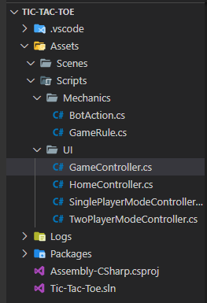
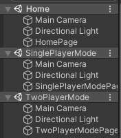
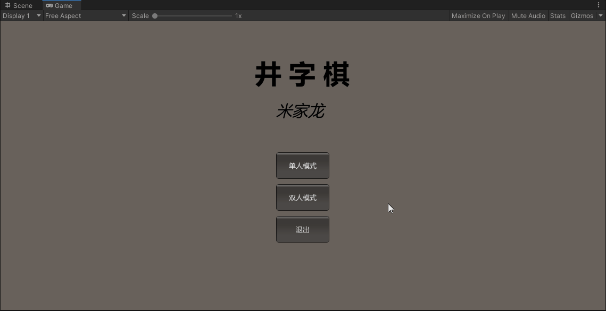
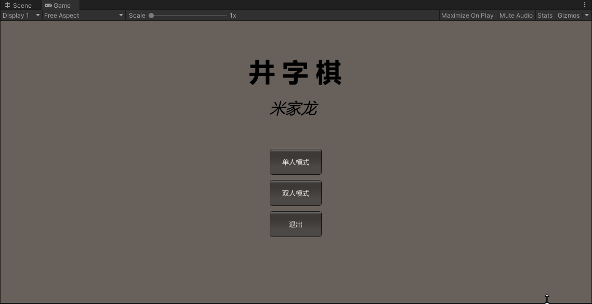
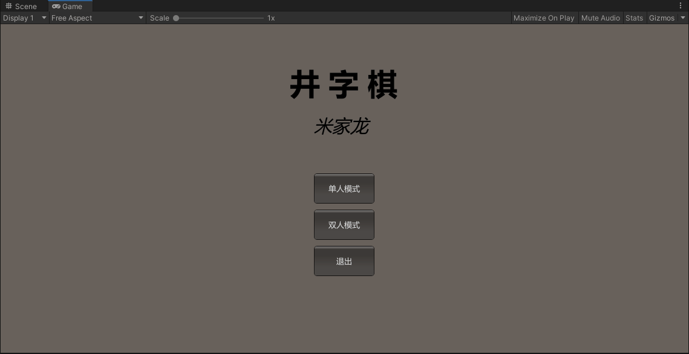
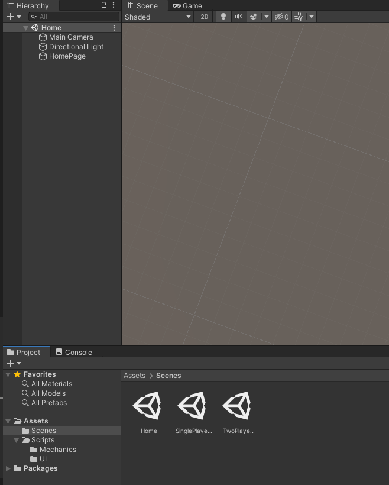

# 井字棋使用说明

- [井字棋使用说明](#井字棋使用说明)
  - [思路与实现](#思路与实现)
  - [具体效果](#具体效果)
  - [使用说明](#使用说明)
    - [方法一：直接运行可执行文件](#方法一直接运行可执行文件)
    - [方法二：下载项目文件](#方法二下载项目文件)
    - [方法三：下载 Assets 文件](#方法三下载-assets-文件)

## 思路与实现

假设游戏分为三个场景
- 主页
  - 三个按钮和标题显示
    - 单人模式，切换到单人模式下和 AI 进行比赛
    - 双人模式，切换到双人模式下，两个玩家之间进行比赛
    - 退出，结束游戏
- 单人模式页面
  - 一个棋盘（3*3）
  - 返回主页按钮
  - 重置棋盘按钮
  - 终局提示（赢/输/平局）
- 双人模式页面
  - 棋盘（3*3）
  - 返回主页按钮
  - 重置棋盘按钮
  - 终局提示（赢/输/平局）

可以发现，该需要三个场景，但第二第三个场景中，可以有较多的代码复用，其中主要的区别是玩家2，单人模式是交给 AI 来担任玩家2，而双人模式是没有这个替代

因此该游戏资源架构如下：



而三个场景中的游戏对象如下：



其中 `SinglePlayerModeController` 和 `TwoPlayerController` 是 `GameController` 的子类，分别绑定着 SinglePlayerMode 和 TwoPlayerMode 的场景中的对应的 Controller 游戏对象，而 `HomeController` 类则是绑定了 Home 场景的 HomePage 对象

在 Mechanics 文件夹中，`GameRule.cs` 脚本是井字棋的基本规则，用于判断游戏是否结束，是否开始

```csharp
using System;
using UnityEngine;

namespace TicTacToe.Mechanics
{
  // 四种状态，分别代表：未着棋 | 平局 | 玩家1着棋 | 玩家2着棋
  public enum Player { Unfinished, Tie, First, Second };

  public class GameRule
  {
    // 用于判断游戏是否正在进行
    protected bool playing = true;

    // 用于判断是否是P1行动
    protected bool turn = true;

    // 储存的历史记录
    protected readonly Player[,] history = new Player[3, 3];

    // 获取游戏状态
    public bool GetPlaying()
    {
      return playing;
    }

    // 获取当前回合所属
    public bool GetTurn()
    {
      return turn;
    }

    // 获取棋盘的位置
    public Player GetHistory(int i, int j)
    {
      return history[i, j];
    }

    // 着棋
    public void SetHistory(int i, int j)
    {
      history[i, j] = turn ? Player.First : Player.Second;
      turn = !turn;
    }

    // 重置
    public void Reset()
    {
      playing = true;
      turn = true;
      // 重置棋盘
      Array.Clear(history, 0, 3 * 3);
    }

    // 检查游戏是否结束
    public Player CheckWin()
    {
      // 行是否已经达成条件
      for (int i = 0; i < 3; ++i)
      {
        if (history[i, 0] != Player.Unfinished &&
            history[i, 0] == history[i, 1] &&
            history[i, 1] == history[i, 2])
        {
          playing = false;
          return history[i, 0];
        }
      }

      // 列是否已经达成条件
      for (int j = 0; j < 3; ++j)
      {
        if (history[0, j] != Player.Unfinished &&
            history[0, j] == history[1, j] &&
            history[1, j] == history[2, j])
        {
          playing = false;
          return history[0, j];
        }
      }

      // 斜线是否达成条件
      if (history[1, 1] != Player.Unfinished)
      {
        if (history[1, 1] == history[0, 0] && history[1, 1] == history[2, 2] ||
            history[1, 1] == history[0, 2] && history[1, 1] == history[2, 0])
        {
          playing = false;
          return history[1, 1];
        }
      }

      // 判断是否平局
      var numOfUnfinished = 0;
      for (int i = 0; i < 3; ++i)
      {
        for (int j = 0; j < 3; ++j)
        {
          if (history[i, j] == Player.Unfinished)
          {
            numOfUnfinished++;
          }
        }
      }
      if (numOfUnfinished == 0)
      {
        playing = false;
        return Player.Tie;
      }
      return Player.Unfinished;
    }

    public virtual void AIMove() { }
  }
}
```

而 `BotAction.cs` 中，则参考了学长的提示，进行了单人模式下机器人行为的编写，该机器人行为是：阻挡 > 获得胜利 > 随机着棋，代码如下：

```csharp
using System.Collections;
using System.Collections.Generic;
using UnityEngine;

namespace TicTacToe.Mechanics
{
  public class BotAction : GameRule
  {
    // ai 下一步需要走的坐标
    private int ai_x = -1;
    private int ai_y = -1;

    public override void AIMove()
    {
      ai_x = ai_y = -1;
      if (TryBlock()) { }
      else if (TryWin()) { }
      else
      {
        RandomMove();
      }
      SetHistory(ai_x, ai_y);
    }

    // 尝试赢
    private bool TryWin()
    {
      // AI is the Player 2.
      for (int i = 0; i < 3; ++i)
      {
        for (int j = 0; j < 3; ++j)
        {
          if (TryWinInCrossLine(i, j) || TryWinInRow(i, j) || TryWinInColumn(i, j))
          {
            return true;
          }
        }
      }
      return false;
    }

    // 尝试组织
    private bool TryBlock()
    {
      // AI is the Player 2.
      for (int i = 0; i < 3; ++i)
      {
        for (int j = 0; j < 3; ++j)
        {
          if (TryBlockInCrossLine(i, j) || TryBlockInRow(i, j) || TryBlockInColumn(i, j))
          {
            return true;
          }
        }
      }
      return false;
    }

    // 看斜线能否走，会顺带设置下一步的坐标
    private bool CheckInCrossLine(int i, int j, Player player)
    {
      if (i + j == 1 || history[i, j] != player) { return false; }
      if (i == 0)
      {
        if (j == 0 && history[1, 1] == player && history[2, 2] == Player.Unfinished)
        {
          ai_x = 2;
          ai_y = 2;
          return true;
        }
        if (j == 0 && history[2, 2] == player && history[1, 1] == Player.Unfinished)
        {
          ai_x = 1;
          ai_y = 1;
          return true;
        }
        if (j == 2 && history[1, 1] == player && history[0, 2] == Player.Unfinished)
        {
          ai_x = 0;
          ai_y = 2;
          return true;
        }
        if (j == 2 && history[0, 2] == player && history[1, 1] == Player.Unfinished)
        {
          ai_x = 1;
          ai_y = 1;
          return true;
        }
      }
      if (i == 1)
      {
        if (history[0, 0] == player && history[2, 2] == Player.Unfinished)
        {
          ai_x = 2;
          ai_y = 2;
          return true;
        }
        if (history[2, 2] == player && history[0, 0] == Player.Unfinished)
        {
          ai_x = 0;
          ai_y = 0;
          return true;
        }
        if (history[2, 0] == player && history[0, 2] == Player.Unfinished)
        {
          ai_x = 0;
          ai_y = 2;
          return true;
        }
        if (history[0, 2] == player && history[2, 0] == Player.Unfinished)
        {
          ai_x = 2;
          ai_y = 0;
          return true;
        }
      }
      if (i == 2)
      {
        if (j == 0 && history[1, 1] == player && history[2, 0] == Player.Unfinished)
        {
          ai_x = 2;
          ai_y = 0;
          return true;
        }
        if (j == 0 && history[2, 0] == player && history[1, 1] == Player.Unfinished)
        {
          ai_x = 1;
          ai_y = 1;
          return true;
        }
        if (j == 2 && history[1, 1] == player && history[0, 0] == Player.Unfinished)
        {
          ai_x = 0;
          ai_y = 0;
          return true;
        }
        if (j == 2 && history[0, 0] == player && history[1, 1] == Player.Unfinished)
        {
          ai_x = 1;
          ai_y = 1;
          return true;
        }
      }
      return false;
    }

    // 检查行是否能走，并且设置下一步坐标
    private bool CheckInRow(int i, int j, Player player)
    {
      if (history[i, j] != player) { return false; }
      if (j == 0)
      {
        if (history[i, 1] == player && history[i, 2] == Player.Unfinished)
        {
          ai_x = i;
          ai_y = 2;
          return true;
        }
        if (history[i, 2] == player && history[i, 1] == Player.Unfinished)
        {
          ai_x = i;
          ai_y = 1;
          return true;
        }
      }
      if (j == 1)
      {
        if (history[i, 0] == player && history[i, 2] == Player.Unfinished)
        {
          ai_x = i;
          ai_y = 2;
          return true;
        }
        if (history[i, 2] == player && history[i, 0] == Player.Unfinished)
        {
          ai_x = i;
          ai_y = 0;
          return true;
        }
      }
      if (j == 2)
      {
        if (history[i, 0] == player && history[i, 1] == Player.Unfinished)
        {
          ai_x = i;
          ai_y = 1;
          return true;
        }
        if (history[i, 1] == player && history[i, 0] == Player.Unfinished)
        {
          ai_x = i;
          ai_y = 0;
          return true;
        }
      }
      return false;
    }

    // 检查列是否能走，并且设置下一步坐标
    private bool CheckInColumn(int i, int j, Player player)
    {
      if (history[i, j] != player) { return false; }
      if (i == 0)
      {
        if (history[1, j] == player && history[2, j] == Player.Unfinished)
        {
          ai_x = 2;
          ai_y = j;
          return true;
        }
        if (history[2, j] == player && history[1, j] == Player.Unfinished)
        {
          ai_x = 1;
          ai_y = j;
          return true;
        }
      }
      if (i == 1)
      {
        if (history[0, j] == player && history[2, j] == Player.Unfinished)
        {
          ai_x = 2;
          ai_y = j;
          return true;
        }
        if (history[2, j] == player && history[0, j] == Player.Unfinished)
        {
          ai_x = 0;
          ai_y = j;
          return true;
        }
      }
      if (i == 2)
      {
        if (history[0, j] == player && history[1, j] == Player.Unfinished)
        {
          ai_x = 1;
          ai_y = j;
          return true;
        }
        if (history[1, j] == player && history[0, j] == Player.Unfinished)
        {
          ai_x = 0;
          ai_y = j;
          return true;
        }
      }
      return false;
    }


    // 检查斜线是否能赢
    private bool TryWinInCrossLine(int i, int j)
    {
      return CheckInCrossLine(i, j, Player.Second);
    }

    // 检查行是否能赢
    private bool TryWinInRow(int i, int j)
    {
      return CheckInRow(i, j, Player.Second);
    }

    // 检查列是否能赢
    private bool TryWinInColumn(int i, int j)
    {
      return CheckInColumn(i, j, Player.Second);
    }

    // 检查玩家斜线是否能赢，尝试阻止
    private bool TryBlockInCrossLine(int i, int j)
    {
      return CheckInCrossLine(i, j, Player.First);
    }

    // 检查玩家行是否能赢，尝试阻止
    private bool TryBlockInRow(int i, int j)
    {
      return CheckInRow(i, j, Player.First);
    }

    // 检查玩家列是否能赢，尝试阻止
    private bool TryBlockInColumn(int i, int j)
    {
      return CheckInColumn(i, j, Player.First);
    }

    // 随机走一步
    private void RandomMove()
    {
      List<int> row = new List<int>();
      List<int> col = new List<int>();
      int count = 0;
      for (int i = 0; i < 3; ++i)
      {
        for (int j = 0; j < 3; ++j)
        {
          if (history[i, j] == Player.Unfinished)
          {
            row.Add(i);
            col.Add(j);
            count++;
          }
        }
      }
      // Here count must be greater than 0.
      System.Random rand = new System.Random();
      int index = rand.Next(0, count);
      ai_x = row[index];
      ai_y = col[index];
    }
  }
}
```

## 具体效果

具体效果如下：

> 鼠标点击时的黄圈是录制软件添加的

单人模式：



双人模式：



主页：


## 使用说明

### 方法一：直接运行可执行文件

下载 [可执行文件（压缩包 20.5MB）](./zip/Tic-Tac-Toe%20exe.zip) ，解压之后直接点击 `Tic-Tac-Toe.exe` 运行

### 方法二：下载项目文件

下载 [项目文件（压缩包 49.5M）](./zip/Tic-Tac-Toe.zip) ，解压之后用 unity 打开

### 方法三：下载 Assets 文件

> 本项目使用 unity 2019.4.9f1 版本（是 lts 版本）完成，对于2020的 unity 兼容性无法保证（因为没用过）

下载 [资源文件（压缩包 18.4KB）](./zip/Assets.zip) ，在 unity 中新建项目，使用解压后的 Assets 文件夹替换掉原来的 Assets 文件夹，将项目原本的 Scene 删除，将 Assets/Scenes 中的 Home 拖入 Hierarchy 栏中（如下图），之后运行游戏即可



