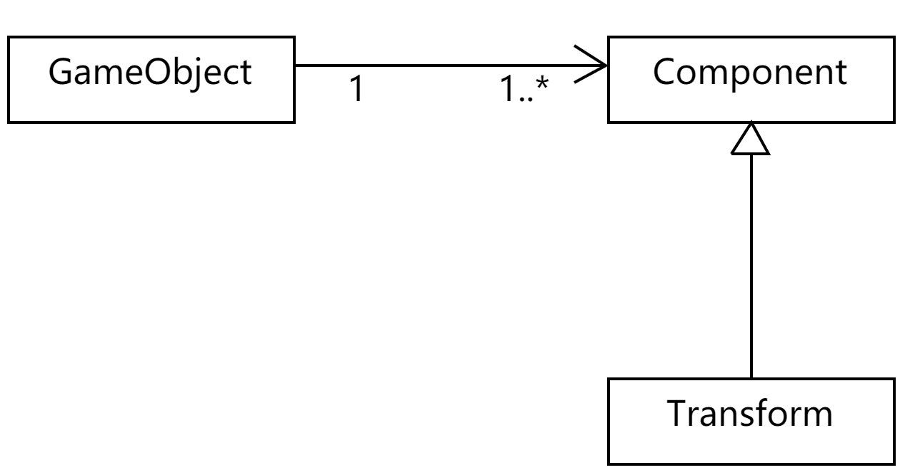

# 离散仿真引擎基础

- [离散仿真引擎基础](#离散仿真引擎基础)
  - [1. 简答题](#1-简答题)
    - [Q1.1](#q11)
    - [Q1.2](#q12)
      - [FPS Microgame](#fps-microgame)
      - [Platformer Microgame](#platformer-microgame)
    - [Q1.3](#q13)
    - [Q1.4](#q14)
      - [Q1.4.1](#q141)
      - [Q1.4.2](#q142)
      - [Q1.4.3](#q143)
    - [Q1.5](#q15)
  - [2. 编程实践：小游戏](#2-编程实践小游戏)
  - [3. 思考题](#3-思考题)
    - [Q3.1](#q31)
    - [Q3.2](#q32)
    - [Q3.3](#q33)

## 1. 简答题

### Q1.1

> 解释游戏对象（GameObjects） 和 资源（Assets）的区别与联系。

- GameObject (游戏对象)：在 Unity 中，游戏的所有对象都是游戏对象，它被认为是 Unity 游戏场景中所有实例的基类
- Assets (资源)：在 Unity 中，资源包含 C# 脚本、材质、音频、场景和预制对象等，游戏对象会使用资源来具体表现出制作者想要的效果；其中预制对象由游戏对象装换而来，也可以编程实例（即游戏对象）
- 游戏对象使用资源，是资源的具体表现，其可通过预设的来转变成资源；资源被游戏对象使用，而其中的预制对象也可以转变成游戏对象

### Q1.2

> 下载几个游戏案例，分别总结资源、对象组织的结构（指资源的目录组织结构与游戏对象树的层次结构）

#### FPS Microgame

下载的是 [FPS Microgame](https://learn.unity.com/project/fps-microgame) 作为案例，通过 unity 打开这个项目：


查看资源架构，可以发现资源以**文件夹目录**的形式组织的，在 FPS 文件夹中，架构如下：
- 动画
- 美术（包括贴图材质等）
- 音频
- 预制对象（包括 UI 和武器等）
- 场景（该游戏有两个场景）


查看对象架构，是以层级结构的形式来组织的，可分为：
- 常规（游戏管理器和事件系统等）
- 玩家
- 敌人（有两种）
- 道路（传送门）
- 拾取物品（掉落物）
- 等级相关

#### Platformer Microgame

[平台跳跃项目](https://learn.unity.com/project/2d-platformer-template)，打开后：


资源架构依然是按照文件夹目录的形式组织，分为：
- 音频
- 人物
- 文档
- 编辑器
- 环境
- 预制对象
- 场景
- 脚本
- 瓷砖（材质？）


对象也是以层次结构组织，分为：
- 游戏控制器
- UI 画板
- 主摄像机
- 事件系统
- 玩家
- 栅格
- 敌人
- 外星人
- 等

### Q1.3

> 编写一个代码，使用 debug 语句来验证 MonoBehaviour 基本行为或事件触发的条件
> - 基本行为包括 Awake() Start() Update() FixedUpdate() LateUpdate()
> - 常用事件包括 OnGUI() OnDisable() OnEnable()

```csharp
using System.Collections;
using System.Collections.Generic;
using UnityEngine;

public class FirstBeh : MonoBehaviour
{
  // Start is called before the first frame update
  void Start()
  {
    Debug.Log("start");
  }

  // Update is called once per frame
  void Update()
  {
    Debug.Log("update");
  }

  void FixedUpdate()
  {
    Debug.Log("FixUpdate");
  }

  void LateUpdate()
  {
    Debug.Log("LateUpdate");
  }

  void Awake()
  {
    Debug.Log("awake");
  }

  void OnGUI()
  {
    Debug.Log("OnGUI");
  }

  void OnEnable()
  {
    Debug.Log("OnEnable");
  }

  void OnDisable()
  {
    Debug.Log("OnDisable");
  }
}
```

运行之后，得到如下输出


多次点击游戏对象旁边的 check-box ，可以获得如下输出：


通过上述输出可以得出相关事件的触发规律：

| 事件       | 触发时机                               |
| :--------- | :------------------------------------- |
| Awake      | 当脚本实例被载入时或者脚本构造时触发   |
| Start      | 第一次进入游戏循环（游戏开始）时触发   |
| FixUpdate  | 每次游戏循环进行时，物理引擎调用       |
| Update     | 所有 Start 调用完之后，循环调用        |
| LateUpdate | Update 之后调用                        |
| OnGUI      | 在游戏循环的渲染过程的场景渲染之后调用 |
| OnEnable   | 游戏对象启用时调用                     |
| OnDisable  | 游戏对象被禁用时调用                   |

### Q1.4

> 查找脚本手册，了解 GameObject，Transform，Component 对象
> - 分别翻译官方对三个对象的描述（Description）
> - 描述下图中 table 对象（实体）的属性、table 的 Transform 的属性、 table 的部件
>    - 本题目要求是把可视化图形编程界面与 Unity API 对应起来，当你在 Inspector 面板上每一个内容，应该知道对应 API。
>    - 例如：table 的对象是 GameObject，第一个选择框是 activeSelf 属性。
> - 用 UML 图描述 三者的关系（请使用 *UMLet 14.1.1 stand-alone* 版本出图）

#### Q1.4.1

**GameObject** :
- *Base class for all entities in Unity Scenes.*
- 游戏对象是 Unity 中所有实例的基类

**Transform**
- *Position, rotation and scale of an object. Every object in a Scene has a Transform. It’s used to store and manipulate the position, rotation and scale of the object.*
- Transform 是一个对象的位置、旋转和缩放比例。每个在 unity 的场景中的实例对象都有 Transform 。它用于储存并且操作/控制对象的位置、旋转和缩放

**Component**
- *Base class for everything attached to GameObjects.*
- 组件是所有附加在游戏对象上的内容的基类

#### Q1.4.2

table 的属性如图：

- 第一个框
  - 选择框是 activeSelf 属性，右边是 name ，代表该游戏对象的名字
  - 下面的 tag 用于对象的标签
  - layer 则是所属的层级
  - static 属性则是指定游戏对象是否是静态的
- 第二个框是 Transform ，储存了位置、旋转和缩放比例
- 第三个框及其后面则是该游戏其他组件，包括材质和渲染以及脚本

#### Q1.4.3

如图：


### Q1.5

> 资源预设（Prefabs）与 对象克隆 (clone)
> - 预设（Prefabs）有什么好处？
> - 预设与对象克隆 (clone or copy or Instantiate of Unity Object) 关系？
> - 制作 table 预制，写一段代码将 table 预制资源实例化成游戏对象

预制对象好处：
- 对于大量相同的游戏对象，可以通过设置同一个预制对象来实现创建，从而提高开发效率
- 修改预制对象之后，其创建的所有游戏对象都会继承修改

预设和对象克隆的关系：
- 通过预设创建的实例会随着预设的变化而变化，但是克隆/复制的则不会

新建一个一个 C# 脚本，代码如下：
```csharp
using System.Collections;
using System.Collections.Generic;
using UnityEngine;

public class CreateTable : MonoBehaviour
{
  public GameObject table;

  // Start is called before the first frame update
  void Start()
  {
    GameObject newObj = Instantiate(table);
    newObj.name = "NewTable"; // 设置实例名称
    newObj.transform.position = new Vector3(0, (float)0.5, 0); // 设置起始位置
    newObj.transform.parent = this.transform;
  }

  // Update is called once per frame
  void Update()
  {

  }
}
```

将其绑定在 Main Camera 对象上（这是个偷懒做法，但是实际上并不推荐绑定到这个对象上），并选择预制对象 Table 为 Assets 中的 Table ，如图：


运行游戏，可以发现能够成功创建了一个 Table 作为 Main Camera 子对象，如图


## 2. 编程实践：小游戏

[说明文档](./doc.md)

## 3. 思考题

### Q3.1

> 微软 XNA 引擎的 Game 对象屏蔽了游戏循环的细节，并使用一组虚方法让继承者完成它们，我们称这种设计为“模板方法模式”。
> - 为什么是“模板方法”模式而不是“策略模式”呢？

- **模板方法模式**：将算法流程定义好，具体实现一些特定步骤，使其延迟到子类；使得开发者能够通过不同的**子类**来实现定制流程中特定的步骤，并且**不改变算法**。
- **策略模式**：在不影响客户端使用的前提下，不同的算法可以**相互替换**

XNA 引擎已经定义好了游戏循环的执行流程，因此为了避免开发者修改流程，才采用了*模板方法模式*

### Q3.2

> 将游戏对象组成树型结构，每个节点都是游戏对象（或数）。
> - 尝试解释组合模式（Composite Pattern / 一种设计模式）。
> - 使用 BroadcastMessage() 方法，向子对象发送消息。你能写出 BroadcastMessage() 的伪代码吗?

组合模式使用**树形结构**来组合对象，从而区分、表现和记录层次关系，最终创建出树形结构的对象组

参考网上资料，实现 BroadcastMessage() 方法
代码：

```csharp
// 反射实现 BroadcastMessage
// methodName 方法名
// parameter 参数对象
void OwnBroadcastMessage(string methodName, object parameter)
{
  // 遍历对象树
  foreach (Transform child in this.transform)
  {
    // 获取 Script 部件实例（可能存在多个）
    var monos = child.gameObject.GetComponents<MonoBehaviour>();

    foreach (var mono in monos)
    {
      var type = mono.GetType();

      // 设定方法绑定属性
      var bindingAttr = System.Reflection.BindingFlags.NonPublic | System.Reflection.BindingFlags.Instance | System.Reflection.BindingFlags.Public;

      // 获取指定名称的方法
      var method = type.GetMethod(methodName, bindingAttr);

      // 判断方法是否存在
      if (method != null)
      {
          // 若存在方法，传递参数并调用
          method.Invoke(mono, new object[] { parameter });
      }
    }
  }
}
```

### Q3.3

> 一个游戏对象用许多部件描述不同方面的特征。我们设计坦克（Tank）游戏对象不是继承于GameObject对象，而是 GameObject 添加一组行为部件（Component）。
> - 这是什么设计模式？
> - 为什么不用继承设计特殊的游戏对象？

该设计模式是**装饰器模式**，采用了**组合模式**的思路

为什么不用继承来实现
- 继承可以实现类复用，但类的复用的实现还可以通过**类的关联组合**实现
- 继承**不利于测试**：如果使用继承，在 mock 数据时需要对基类进行 mock 操作，而组合模式则只需要注入不同的实例
- 继承**不利于封装**：基类如果修改，子类也会进行修改，行为的传递导致变化的影响变得巨大，使得子类变得不稳定
- 继承**灵活性较差**：继承如果需要进行相关行为的添加，可以选择在直接在子类或者基类上进行添加，但远不如直接组合来的方便灵活