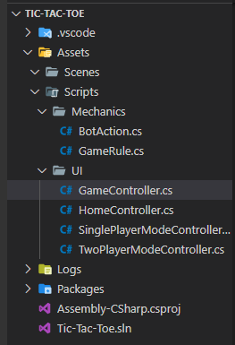

# 离散仿真引擎基础

- [离散仿真引擎基础](#离散仿真引擎基础)
  - [1. 简答题](#1-简答题)
    - [Q1.1](#q11)
    - [Q1.2](#q12)
      - [FPS Microgame](#fps-microgame)
      - [Karting Microgame](#karting-microgame)
    - [Q1.3](#q13)
    - [Q1.4](#q14)
      - [Q1.4.1](#q141)
      - [Q1.4.2](#q142)
      - [Q1.4.3](#q143)
    - [Q1.5](#q15)
  - [2. 编程实践：小游戏](#2-编程实践小游戏)
    - [思路与实现](#思路与实现)
    - [具体效果](#具体效果)
    - [使用说明](#使用说明)
      - [方法一：直接运行可执行文件](#方法一直接运行可执行文件)
      - [方法二：下载项目文件](#方法二下载项目文件)
      - [方法三：下载 Assets 文件](#方法三下载-assets-文件)
  - [3. 思考题](#3-思考题)
    - [Q3.1](#q31)
    - [Q3.2](#q32)
    - [Q3.3](#q33)

## 1. 简答题

### Q1.1

> 解释游戏对象（GameObjects） 和 资源（Assets）的区别与联系。

- GameObject (游戏对象)：在 Unity 中，游戏的所有对象都是游戏对象，它被认为是 Unity 游戏场景中所有实例的基类
- Assets (资源)：在 Unity 中，资源包含 C# 脚本、材质、音频、场景和预制对象等，游戏对象会使用资源来具体表现出制作者想要的效果；其中预制对象由游戏对象装换而来，也可以编程实例（即游戏对象）
- 游戏对象使用资源，是资源的具体表现，其可通过预设的来转变成资源；资源被游戏对象使用，而其中的预制对象也可以转变成游戏对象

### Q1.2

> 下载几个游戏案例，分别总结资源、对象组织的结构（指资源的目录组织结构与游戏对象树的层次结构）

#### FPS Microgame

下载的是 [FPS Microgame](https://learn.unity.com/project/fps-microgame) 作为案例，通过 unity 打开这个项目：


查看资源架构，可以发现资源以**文件夹目录**的形式组织的，在 FPS 文件夹中，架构如下：
- 动画
- 美术（包括贴图材质等）
- 音频
- 预制对象（包括 UI 和武器等）
- 场景（该游戏有两个场景）


查看对象架构，是以层级结构的形式来组织的，可分为：
- 常规（游戏管理器和事件系统等）
- 玩家
- 敌人（有两种）
- 道路（传送门）
- 拾取物品（掉落物）
- 等级相关

#### Karting Microgame

[卡丁车项目](https://api.unity.cn/v1/oauth2/session_token/authorize?token=iHFL_nNyepwmG2-NIU59Cg01ef)，打开后：


资源架构依然是按照文件夹目录的形式组织，分为：
- 音频
- 人物
- 文档
- 编辑器
- 环境
- 预制对象
- 场景
- 脚本
- 瓷砖（材质？）


对象也是以层次结构组织，分为：
- 游戏控制器
- UI 画板
- 主摄像机
- 事件系统
- 玩家
- 栅格
- 敌人
- 外星人
- 等

### Q1.3

> 编写一个代码，使用 debug 语句来验证 MonoBehaviour 基本行为或事件触发的条件
> - 基本行为包括 Awake() Start() Update() FixedUpdate() LateUpdate()
> - 常用事件包括 OnGUI() OnDisable() OnEnable()

```csharp
using System.Collections;
using System.Collections.Generic;
using UnityEngine;

public class FirstBeh : MonoBehaviour
{
  // Start is called before the first frame update
  void Start()
  {
    Debug.Log("start");
  }

  // Update is called once per frame
  void Update()
  {
    Debug.Log("update");
  }

  void FixedUpdate()
  {
    Debug.Log("FixUpdate");
  }

  void LateUpdate()
  {
    Debug.Log("LateUpdate");
  }

  void Awake()
  {
    Debug.Log("awake");
  }

  void OnGUI()
  {
    Debug.Log("OnGUI");
  }

  void OnEnable()
  {
    Debug.Log("OnEnable");
  }

  void OnDisable()
  {
    Debug.Log("OnDisable");
  }
}
```

运行之后，得到如下输出


多次点击游戏对象旁边的 check-box ，可以获得如下输出：


通过上述输出可以得出相关事件的触发规律：

| 事件       | 触发时机                               |
| :--------- | :------------------------------------- |
| Awake      | 当脚本实例被载入时或者脚本构造时触发   |
| Start      | 第一次进入游戏循环（游戏开始）时触发   |
| FixUpdate  | 每次游戏循环进行时，物理引擎调用       |
| Update     | 所有 Start 调用完之后，循环调用        |
| LateUpdate | Update 之后调用                        |
| OnGUI      | 在游戏循环的渲染过程的场景渲染之后调用 |
| OnEnable   | 游戏对象启用时调用                     |
| OnDisable  | 游戏对象被禁用时调用                   |

### Q1.4

> 查找脚本手册，了解 GameObject，Transform，Component 对象
> - 分别翻译官方对三个对象的描述（Description）
> - 描述下图中 table 对象（实体）的属性、table 的 Transform 的属性、 table 的部件
>    - 本题目要求是把可视化图形编程界面与 Unity API 对应起来，当你在 Inspector 面板上每一个内容，应该知道对应 API。
>    - 例如：table 的对象是 GameObject，第一个选择框是 activeSelf 属性。
> - 用 UML 图描述 三者的关系（请使用 *UMLet 14.1.1 stand-alone* 版本出图）

#### Q1.4.1

**GameObject** :
- *Base class for all entities in Unity Scenes.*
- 游戏对象是 Unity 中所有实例的基类

**Transform**
- *Position, rotation and scale of an object. Every object in a Scene has a Transform. It’s used to store and manipulate the position, rotation and scale of the object.*
- Transform 是一个对象的位置、旋转和缩放比例。每个在 unity 的场景中的实例对象都有 Transform 。它用于储存并且操作/控制对象的位置、旋转和缩放

**Component**
- *Base class for everything attached to GameObjects.*
- 组件是所有附加在游戏对象上的内容的基类

#### Q1.4.2

table 的属性如图：

- 第一个框
  - 选择框是 activeSelf 属性，右边是 name ，代表该游戏对象的名字
  - 下面的 tag 用于对象的标签
  - layer 则是所属的层级
  - static 属性则是指定游戏对象是否是静态的
- 第二个框是 Transform ，储存了位置、旋转和缩放比例
- 第三个框及其后面则是该游戏其他组件，包括材质和渲染以及脚本

#### Q1.4.3

如图：


### Q1.5

> 资源预设（Prefabs）与 对象克隆 (clone)
> - 预设（Prefabs）有什么好处？
> - 预设与对象克隆 (clone or copy or Instantiate of Unity Object) 关系？
> - 制作 table 预制，写一段代码将 table 预制资源实例化成游戏对象

预制对象好处：
- 对于大量相同的游戏对象，可以通过设置同一个预制对象来实现创建，从而提高开发效率
- 修改预制对象之后，其创建的所有游戏对象都会继承修改

预设和对象克隆的关系：
- 通过预设创建的实例会随着预设的变化而变化，但是克隆/复制的则不会

新建一个一个 C# 脚本，代码如下：
```csharp
using System.Collections;
using System.Collections.Generic;
using UnityEngine;

public class CreateTable : MonoBehaviour
{
  public GameObject table;

  // Start is called before the first frame update
  void Start()
  {
    GameObject newObj = Instantiate(table);
    newObj.name = "NewTable"; // 设置实例名称
    newObj.transform.position = new Vector3(0, (float)0.5, 0); // 设置起始位置
    newObj.transform.parent = this.transform;
  }

  // Update is called once per frame
  void Update()
  {

  }
}
```

将其绑定在 Main Camera 对象上（这是个偷懒做法，但是实际上并不推荐绑定到这个对象上），并选择预制对象 Table 为 Assets 中的 Table ，如图：


运行游戏，可以发现能够成功创建了一个 Table 作为 Main Camera 子对象，如图


## 2. 编程实践：小游戏

### 思路与实现

假设游戏分为三个场景
- 主页
  - 三个按钮和标题显示
    - 单人模式，切换到单人模式下和 AI 进行比赛
    - 双人模式，切换到双人模式下，两个玩家之间进行比赛
    - 退出，结束游戏
- 单人模式页面
  - 一个棋盘（3*3）
  - 返回主页按钮
  - 重置棋盘按钮
  - 终局提示（赢/输/平局）
- 双人模式页面
  - 棋盘（3*3）
  - 返回主页按钮
  - 重置棋盘按钮
  - 终局提示（赢/输/平局）

可以发现，该需要三个场景，但第二第三个场景中，可以有较多的代码复用，其中主要的区别是玩家2，单人模式是交给 AI 来担任玩家2，而双人模式是没有这个替代

因此该游戏资源架构如下：



而三个场景中的游戏对象如下：


其中 `SinglePlayerModeController` 和 `TwoPlayerController` 是 `GameController` 的子类，分别绑定着 SinglePlayerMode 和 TwoPlayerMode 的场景中的对应的 Controller 游戏对象，而 `HomeController` 类则是绑定了 Home 场景的 HomePage 对象

在 Mechanics 文件夹中，Basic.cs 脚本是井字棋的基本规则，用于判断游戏是否结束，是否开始

```csharp
using System;
using UnityEngine;

namespace TicTacToe.Mechanics
{
  // 四种状态，分别代表：未着棋 | 平局 | 玩家1着棋 | 玩家2着棋
  public enum Player { Unfinished, Tie, First, Second };

  public class Basic
  {
    // 用于判断游戏是否正在进行
    protected bool playing = true;

    // 用于判断是否是P1行动
    protected bool turn = true;

    // 储存的历史记录
    protected readonly Player[,] history = new Player[3, 3];

    // 获取游戏状态
    public bool GetPlaying()
    {
      return playing;
    }

    // 获取当前回合所属
    public bool GetTurn()
    {
      return turn;
    }

    // 获取棋盘的位置
    public Player GetHistory(int i, int j)
    {
      return history[i, j];
    }

    // 着棋
    public void SetHistory(int i, int j)
    {
      history[i, j] = turn ? Player.First : Player.Second;
      turn = !turn;
    }

    // 重置
    public void Reset()
    {
      playing = true;
      turn = true;
      // 重置棋盘
      Array.Clear(history, 0, 3 * 3);
    }

    // 检查游戏是否结束
    public Player CheckWin()
    {
      // 行是否已经达成条件
      for (int i = 0; i < 3; ++i)
      {
        if (history[i, 0] != Player.Unfinished &&
            history[i, 0] == history[i, 1] &&
            history[i, 1] == history[i, 2])
        {
          playing = false;
          return history[i, 0];
        }
      }

      // 列是否已经达成条件
      for (int j = 0; j < 3; ++j)
      {
        if (history[0, j] != Player.Unfinished &&
            history[0, j] == history[1, j] &&
            history[1, j] == history[2, j])
        {
          playing = false;
          return history[0, j];
        }
      }

      // 斜线是否达成条件
      if (history[1, 1] != Player.Unfinished)
      {
        if (history[1, 1] == history[0, 0] && history[1, 1] == history[2, 2] ||
            history[1, 1] == history[0, 2] && history[1, 1] == history[2, 0])
        {
          playing = false;
          return history[1, 1];
        }
      }

      // 判断是否平局
      var numOfUnfinished = 0;
      for (int i = 0; i < 3; ++i)
      {
        for (int j = 0; j < 3; ++j)
        {
          if (history[i, j] == Player.Unfinished)
          {
            numOfUnfinished++;
          }
        }
      }
      if (numOfUnfinished == 0)
      {
        playing = false;
        return Player.Tie;
      }
      return Player.Unfinished;
    }

    public virtual void AIMove() { }
  }
}
```

而 `SinglePlayerMode.cs` 中，则参考了网上的资料，进行了单人模式下机器人行为的编写，该机器人行为是：阻挡 > 获得胜利 > 随机着棋，代码如下：

```csharp
using System.Collections;
using System.Collections.Generic;
using UnityEngine;

namespace TicTacToe.Mechanics
{
  public class SinglePlayerMode : Basic
  {
    // ai 下一步需要走的坐标
    private int ai_x = -1;
    private int ai_y = -1;

    public override void AIMove()
    {
      ai_x = ai_y = -1;
      if (TryBlock()) { }
      else if (TryWin()) { }
      else
      {
        RandomMove();
      }
      SetHistory(ai_x, ai_y);
    }

    // 尝试赢
    private bool TryWin()
    {
      // AI is the Player 2.
      for (int i = 0; i < 3; ++i)
      {
        for (int j = 0; j < 3; ++j)
        {
          if (TryWinInCrossLine(i, j) || TryWinInRow(i, j) || TryWinInColumn(i, j))
          {
            return true;
          }
        }
      }
      return false;
    }

    // 尝试组织
    private bool TryBlock()
    {
      // AI is the Player 2.
      for (int i = 0; i < 3; ++i)
      {
        for (int j = 0; j < 3; ++j)
        {
          if (TryBlockInCrossLine(i, j) || TryBlockInRow(i, j) || TryBlockInColumn(i, j))
          {
            return true;
          }
        }
      }
      return false;
    }

    // 看斜线能否走，会顺带设置下一步的坐标
    private bool CheckInCrossLine(int i, int j, Player player)
    {
      if (i + j == 1 || history[i, j] != player) { return false; }
      if (i == 0)
      {
        if (j == 0 && history[1, 1] == player && history[2, 2] == Player.Unfinished)
        {
          ai_x = 2;
          ai_y = 2;
          return true;
        }
        if (j == 0 && history[2, 2] == player && history[1, 1] == Player.Unfinished)
        {
          ai_x = 1;
          ai_y = 1;
          return true;
        }
        if (j == 2 && history[1, 1] == player && history[0, 2] == Player.Unfinished)
        {
          ai_x = 0;
          ai_y = 2;
          return true;
        }
        if (j == 2 && history[0, 2] == player && history[1, 1] == Player.Unfinished)
        {
          ai_x = 1;
          ai_y = 1;
          return true;
        }
      }
      if (i == 1)
      {
        if (history[0, 0] == player && history[2, 2] == Player.Unfinished)
        {
          ai_x = 2;
          ai_y = 2;
          return true;
        }
        if (history[2, 2] == player && history[0, 0] == Player.Unfinished)
        {
          ai_x = 0;
          ai_y = 0;
          return true;
        }
        if (history[2, 0] == player && history[0, 2] == Player.Unfinished)
        {
          ai_x = 0;
          ai_y = 2;
          return true;
        }
        if (history[0, 2] == player && history[2, 0] == Player.Unfinished)
        {
          ai_x = 2;
          ai_y = 0;
          return true;
        }
      }
      if (i == 2)
      {
        if (j == 0 && history[1, 1] == player && history[2, 0] == Player.Unfinished)
        {
          ai_x = 2;
          ai_y = 0;
          return true;
        }
        if (j == 0 && history[2, 0] == player && history[1, 1] == Player.Unfinished)
        {
          ai_x = 1;
          ai_y = 1;
          return true;
        }
        if (j == 2 && history[1, 1] == player && history[0, 0] == Player.Unfinished)
        {
          ai_x = 0;
          ai_y = 0;
          return true;
        }
        if (j == 2 && history[0, 0] == player && history[1, 1] == Player.Unfinished)
        {
          ai_x = 1;
          ai_y = 1;
          return true;
        }
      }
      return false;
    }

    // 检查行是否能走，并且设置下一步坐标
    private bool CheckInRow(int i, int j, Player player)
    {
      if (history[i, j] != player) { return false; }
      if (j == 0)
      {
        if (history[i, 1] == player && history[i, 2] == Player.Unfinished)
        {
          ai_x = i;
          ai_y = 2;
          return true;
        }
        if (history[i, 2] == player && history[i, 1] == Player.Unfinished)
        {
          ai_x = i;
          ai_y = 1;
          return true;
        }
      }
      if (j == 1)
      {
        if (history[i, 0] == player && history[i, 2] == Player.Unfinished)
        {
          ai_x = i;
          ai_y = 2;
          return true;
        }
        if (history[i, 2] == player && history[i, 0] == Player.Unfinished)
        {
          ai_x = i;
          ai_y = 0;
          return true;
        }
      }
      if (j == 2)
      {
        if (history[i, 0] == player && history[i, 1] == Player.Unfinished)
        {
          ai_x = i;
          ai_y = 1;
          return true;
        }
        if (history[i, 1] == player && history[i, 0] == Player.Unfinished)
        {
          ai_x = i;
          ai_y = 0;
          return true;
        }
      }
      return false;
    }

    // 检查列是否能走，并且设置下一步坐标
    private bool CheckInColumn(int i, int j, Player player)
    {
      if (history[i, j] != player) { return false; }
      if (i == 0)
      {
        if (history[1, j] == player && history[2, j] == Player.Unfinished)
        {
          ai_x = 2;
          ai_y = j;
          return true;
        }
        if (history[2, j] == player && history[1, j] == Player.Unfinished)
        {
          ai_x = 1;
          ai_y = j;
          return true;
        }
      }
      if (i == 1)
      {
        if (history[0, j] == player && history[2, j] == Player.Unfinished)
        {
          ai_x = 2;
          ai_y = j;
          return true;
        }
        if (history[2, j] == player && history[0, j] == Player.Unfinished)
        {
          ai_x = 0;
          ai_y = j;
          return true;
        }
      }
      if (i == 2)
      {
        if (history[0, j] == player && history[1, j] == Player.Unfinished)
        {
          ai_x = 1;
          ai_y = j;
          return true;
        }
        if (history[1, j] == player && history[0, j] == Player.Unfinished)
        {
          ai_x = 0;
          ai_y = j;
          return true;
        }
      }
      return false;
    }


    // 检查斜线是否能赢
    private bool TryWinInCrossLine(int i, int j)
    {
      return CheckInCrossLine(i, j, Player.Second);
    }

    // 检查行是否能赢
    private bool TryWinInRow(int i, int j)
    {
      return CheckInRow(i, j, Player.Second);
    }

    // 检查列是否能赢
    private bool TryWinInColumn(int i, int j)
    {
      return CheckInColumn(i, j, Player.Second);
    }

    // 检查玩家斜线是否能赢，尝试阻止
    private bool TryBlockInCrossLine(int i, int j)
    {
      return CheckInCrossLine(i, j, Player.First);
    }

    // 检查玩家行是否能赢，尝试阻止
    private bool TryBlockInRow(int i, int j)
    {
      return CheckInRow(i, j, Player.First);
    }

    // 检查玩家列是否能赢，尝试阻止
    private bool TryBlockInColumn(int i, int j)
    {
      return CheckInColumn(i, j, Player.First);
    }

    // 随机走一步
    private void RandomMove()
    {
      List<int> row = new List<int>();
      List<int> col = new List<int>();
      int count = 0;
      for (int i = 0; i < 3; ++i)
      {
        for (int j = 0; j < 3; ++j)
        {
          if (history[i, j] == Player.Unfinished)
          {
            row.Add(i);
            col.Add(j);
            count++;
          }
        }
      }
      // Here count must be greater than 0.
      System.Random rand = new System.Random();
      int index = rand.Next(0, count);
      ai_x = row[index];
      ai_y = col[index];
    }
  }
}
```

### 具体效果

具体效果如下：

> 鼠标点击时的黄圈是录制软件添加的

单人模式：


双人模式：


主页：


### 使用说明

#### 方法一：直接运行可执行文件

下载 [可执行文件（压缩包 20.6MB）](./exe.zip) ，解压之后直接点击 `Tic-Tac-Toe.exe` 运行

#### 方法二：下载项目文件

下载 [项目文件（压缩包 49.8M）](./Tic-Tac-Toe.zip) ，解压之后用 unity 打开

#### 方法三：下载 Assets 文件

> 本项目使用 unity 2019.4.9f1 版本（是 lts 版本）完成，对于2020的 unity 兼容性无法保证（因为没用过）

下载 [资源文件（压缩包 17.7KB）](./Assets.zip) ，在 unity 中新建项目，使用解压后的 Assets 文件夹替换掉原来的 Assets 文件夹，将项目原本的 Scene 删除，将 Assets/Scenes 中的 Home 放入 Hierarchy 栏中（如下图），运行游戏即可


## 3. 思考题

### Q3.1

> 微软 XNA 引擎的 Game 对象屏蔽了游戏循环的细节，并使用一组虚方法让继承者完成它们，我们称这种设计为“模板方法模式”。
> - 为什么是“模板方法”模式而不是“策略模式”呢？

- **模板方法模式**：将算法流程定义好，具体实现一些特定步骤，使其延迟到子类；使得开发者能够通过不同的**子类**来实现定制流程中特定的步骤，并且**不改变算法**。
- **策略模式**：在不影响客户端使用的前提下，不同的算法可以**相互替换**

XNA 引擎已经定义好了游戏循环的执行流程，因此为了避免开发者修改流程，才采用了*模板方法模式*

### Q3.2

> 将游戏对象组成树型结构，每个节点都是游戏对象（或数）。
> - 尝试解释组合模式（Composite Pattern / 一种设计模式）。
> - 使用 BroadcastMessage() 方法，向子对象发送消息。你能写出 BroadcastMessage() 的伪代码吗?

组合模式使用**树形结构**来组合对象，从而区分、表现和记录层次关系，最终创建出树形结构的对象组

参考网上资料，实现 BroadcastMessage() 方法
代码：

```csharp
// 反射实现 BroadcastMessage
// methodName 方法名
// parameter 参数对象
void OwnBroadcastMessage(string methodName, object parameter)
{
  // 遍历对象树
  foreach (Transform child in this.transform)
  {
    // 获取 Script 部件实例（可能存在多个）
    var monos = child.gameObject.GetComponents<MonoBehaviour>();

    foreach (var mono in monos)
    {
      var type = mono.GetType();

      // 设定方法绑定属性
      var bindingAttr = System.Reflection.BindingFlags.NonPublic | System.Reflection.BindingFlags.Instance | System.Reflection.BindingFlags.Public;

      // 获取指定名称的方法
      var method = type.GetMethod(methodName, bindingAttr);

      // 判断方法是否存在
      if (method != null)
      {
          // 若存在方法，传递参数并调用
          method.Invoke(mono, new object[] { parameter });
      }
    }
  }
}
```

### Q3.3

> 一个游戏对象用许多部件描述不同方面的特征。我们设计坦克（Tank）游戏对象不是继承于GameObject对象，而是 GameObject 添加一组行为部件（Component）。
> - 这是什么设计模式？
> - 为什么不用继承设计特殊的游戏对象？

该设计模式是**装饰器模式**，采用了**组合模式**的思路

为什么不用继承来实现
- 继承可以实现类复用，但类的复用的实现还可以通过**类的关联组合**实现
- 继承**不利于测试**：如果使用继承，在 mock 数据时需要对基类进行 mock 操作，而组合模式则只需要注入不同的实例
- 继承**不利于封装**：基类如果修改，子类也会进行修改，行为的传递导致变化的影响变得巨大，使得子类变得不稳定
- 继承**灵活性较差**：继承如果需要进行相关行为的添加，可以选择在直接在子类或者基类上进行添加，但远不如直接组合来的方便灵活