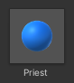
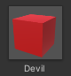
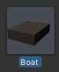
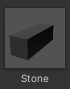
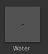
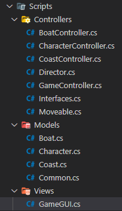
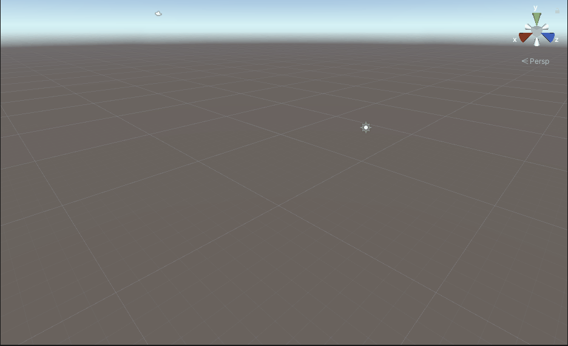

# 牧师与魔鬼项目文档

- [牧师与魔鬼项目文档](#牧师与魔鬼项目文档)
  - [要求](#要求)
  - [游戏对象和动作表](#游戏对象和动作表)
    - [游戏对象](#游戏对象)
    - [动作表](#动作表)
  - [设计职责](#设计职责)
    - [导演](#导演)
    - [场记](#场记)
  - [MVC 结构设计](#mvc-结构设计)
    - [Model](#model)
      - [角色](#角色)
      - [船只](#船只)
      - [岸边](#岸边)
    - [View](#view)
    - [Controller](#controller)
  - [使用方法与效果展示](#使用方法与效果展示)
    - [使用方法](#使用方法)
    - [效果展示](#效果展示)

## 要求

阅读以下游戏脚本:

> Priests and Devils
>
> Priests and Devils is a puzzle game in which you will help the Priests and Devils to cross the river within the time limit. There are 3 priests and 3 devils at one side of the river. They all want to get to the other side of this river, but there is only one boat and this boat can only carry two persons each time. And there must be one person steering the boat from one side to the other side. In the flash game, you can click on them to move them and click the go button to move the boat to the other direction. If the priests are out numbered by the devils on either side of the river, they get killed and the game is over. You can try it in many > ways. Keep all priests alive! Good luck!

程序需要满足的要求：

- [Play the game](http://www.flash-game.net/game/2535/priests-and-devils.html)。
- 列出游戏中提及的事物（Objects）。
- 用表格列出玩家动作表（规则表），注意，动作越少越好。
- 请将游戏中对象做成预制。
- 在 GenGameObjects 中创建长方形、正方形、球及其色彩代表游戏中的对象。
- 使用 C# 集合类型有效组织对象。
- 整个游戏仅主摄像机 和 一个 Empty 对象， **其他对象必须代码动态生成**！！！。整个游戏不许出现 Find 游戏对象， SendMessage 这类突破程序结构的**通讯耦合**语句。**违背本条准则，不给分**。
- 请使用课件架构图编程，**不接受非 MVC 结构程序**。
- 注意细节，例如：船未靠岸，牧师与魔鬼上下船运动中，均不能接受用户事件！

## 游戏对象和动作表

### 游戏对象

游戏对象构建如下表：

| 游戏对象 |           预设对象           | 对象形状/类型 |
| :------: | :--------------------------: | :-----------: |
|   牧师   |  |    Sphere     |
|   恶魔   |   |     Cube      |
|    船    |      |     Cube      |
|   河岸   |   |     Cube      |
|   河流   |   |     Cube      |

### 动作表

|       玩家动作        | 游戏对象具体行为                           |
| :-------------------: | :----------------------------------------- |
| 点击角色（牧师/恶魔） | 船上的角色——上岸                           |
|                       | 岸上的角色——如果船没满，则上船；满则无操作 |
|       点击船只        | 船为空——无操作                             |
|                       | 船不为空——移动船只                         |

## 设计职责

根据课堂内容，我们可以将职责换分为如下三个：
- 导演 * 1，是具体类型（`Director`），负责控制场景切换
- 场景控制 * n（在该游戏中为1），是抽象类型（`ISenceController`），负责每个场景的布景、演员上下场和动作管理等
- 观众 * 1，是抽象类型（`IUserAction`），负责和场景控制交互

后两者的接口为：
```csharp
namespace PriestsAndDevils
{
  public interface ISceneController
  {
    void LoadResources(); // 加载资源，生成游戏对象
  }

  public interface IUserAction
  {
    void ClickBoat();                           // 点击船只事件
    void ClickCharacter(CharacterController c); // 点击角色事件
    void Reset();                               // 重置游戏事件
  }
}
```

### 导演

导演，具体代码如下：
```csharp
using System.Collections;
using System.Collections.Generic;

using UnityEngine;

namespace PriestsAndDevils
{
  public class Director : System.Object
  {
    private static Director instance;                             // 导演必须为单例
    public ISceneController currentSceneController { get; set; }  // 当前场记
    public bool running { get; set; }                             // 游戏是否正在运行
    public int fps // 帧数
    {
      get
      {
        return Application.targetFrameRate;
      }
      set
      {
        Application.targetFrameRate = value;
      }
    }

    // 获取单例
    public static Director GetInstance()
    {
      return instance ?? (instance = new Director());
    }
  }
}
```

### 场记

由于本游戏只有一个场景，因此只需要创建一个场记类，将该场记命名为 `GameController` ，代码如下：
```csharp
using System.Collections;
using System.Collections.Generic;

using UnityEngine;

namespace PriestsAndDevils
{
  // 游戏结果，判断是未结束（正在进行）还是输赢
  public enum Result
  {
    GAMING, // 正在进行
    WINNER, // 赢了
    LOSER, // 输了
  }

  public class GameController : MonoBehaviour, ISceneController, IUserAction
  {
    public CoastController leftCoast;   // 左岸
    public CoastController rightCoast;  // 右岸
    public BoatController boat;         // 船
    public List<CharacterController> characters = new List<CharacterController>(6); // 最大能承载6个角色列表
    private GameGUI gui; // 场景界面

    void Awake()
    {
      Director director = Director.GetInstance(); // 获取导演
      director.currentSceneController = this; // 设置当前场记

      this.gui = gameObject.AddComponent<GameGUI>() as GameGUI; // 设置 gui

      LoadResources();
    }

    // 加载相关资源，生成游戏对象
    public void LoadResources()
    {
      // 加载河流
      // ...

      // 加载左岸
      // ...

      // 加载右岸
      // ...

      // 加载船只
      // ...

      // 加载牧师
      // ...

      // 加载恶魔
      // ...
    }

    // 点击船只触发事件
    public void ClickBoat()
    {
      // 如果船只载客为空，那么船只没法移动
      if (boat.model.IsEmpty())
      {
        return;
      }
      boat.Move();
      gui.result = CheckWinner(); // 移动完之后需要进行机制判断
    }

    // 点击角色触发事件
    public void ClickCharacter(CharacterController character)
    {
      // 如果在船上，那么尝试上岸
      if (character.model.isOnboard)
      {
        boat.GoAshore(character);
        character.GoAshore((boat.location == Location.Right ? rightCoast : leftCoast));
      }
      // 如果在岸上，那么尝试上传（需要考虑船是否满载，是否同岸）
      else
      {
        // 如果不同岸，那么什么都不干
        if (character.location != boat.location)
        {
          return;
        }
        // 如果满载
        else if (boat.model.GetEmptyIndex() == -1)
        {
          return;
        }

        // 上岸行为
        CoastController temp = (character.location == Location.Right ? rightCoast : leftCoast); ;
        temp.GoAboard(character);
        character.GoAboard(boat);
      }

      // 更新场景显示.
      gui.result = CheckWinner();
    }

    // 重置游戏
    public void Reset()
    {
      gui.result = Result.GAMING; // 重置界面
      boat.Reset();               // 充值船的位置
      leftCoast.Reset();          // 重置（清空）左岸人物
      rightCoast.Reset();         // 重置右岸人物

      // 重置人物位置
      for (int i = 0; i < 6; ++i)
      {
        characters[i].Reset();
      }
    }

    // 判断游戏是否结束
    private Result CheckWinner()
    {
      Result result = Result.GAMING; // 储存结果

      // 获取两岸角色构成，用于判断结果
      int leftPriests = leftCoast.model.GetCharacterAmount()[0];
      int leftDevils = leftCoast.model.GetCharacterAmount()[1];
      int rightPriests = rightCoast.model.GetCharacterAmount()[0];
      int rightDevils = rightCoast.model.GetCharacterAmount()[1];

      // 左岸全部人到齐了，游戏胜利
      if (leftPriests + leftDevils == 6)
      {
        result = Result.WINNER;
      }

      // 船在右边，增加船上人员构成
      if (boat.location == Location.Right)
      {
        rightPriests += boat.model.GetCharacterAmount()[0];
        rightDevils += boat.model.GetCharacterAmount()[1];
      }
      // 船在左边，增加船上人员构成
      else
      {
        leftPriests += boat.model.GetCharacterAmount()[0];
        leftDevils += boat.model.GetCharacterAmount()[1];
      }

      // 判断人员构成，看是否输掉游戏
      if ((rightPriests < rightDevils && rightPriests > 0) ||
          (leftPriests < leftDevils && leftPriests > 0))
      {
        result = Result.LOSER;
      }
      return result;
    }
  }
}
```

## MVC 结构设计

具体结构如下图：



### Model

> 管理游戏对象和空间关系等

根据游戏要求，我们需要进行创建的有如下几个类

#### 角色

根据需要，对该类设置了三个属性：
- name
- location
- isOnboard

代码如下：
```csharp
using System.Collections;
using System.Collections.Generic;

using UnityEngine;

namespace PriestsAndDevils
{
  public class Character
  {
    // It 名称
    public string name { get; set; }

    // 用于储存在哪个岸边
    public Location location { get; set; }

    // 判断是否在船上
    public bool isOnboard { get; set; }
  }
}
```

#### 船只

除了需要设置船只的移动判定、位置和角色储存等，还需要使用 Vector3 来表示船上两个位置的方向，具体代码如下：
```csharp
using System.Collections;
using System.Collections.Generic;

using UnityEngine;

namespace PriestsAndDevils
{
  public class Boat
  {
    // 名称，但是好像没用上
    public string name { get; set; }

    // 船的位置：左岸|右岸
    public Location location { get; set; }

    // 分别储存离开时的坐标和目标坐标
    public static readonly Vector3 departure = new Vector3(3, 1, 0);
    public static readonly Vector3 destination = new Vector3(-3, 1, 0);

    // 用于角色移动
    public static readonly Vector3[] departures = { new Vector3(2.5f, 1.5f, 0), new Vector3(3.5f, 1.5f, 0) };
    public static readonly Vector3[] destinations = { new Vector3(-3.5f, 1.5f, 0), new Vector3(-2.5f, 1.5f, 0) };

    // 角色
    public Character[] characters = new Character[2];

    // 初始化船只
    public Boat()
    {
      // 起始时刻，船只需要在右岸
      location = Location.Right;
    }

    // 用于判断船上是否为空载
    public bool IsEmpty()
    {
      // ...
    }

    // 获取船只空的位置
    public int GetEmptyIndex()
    {
      // ...
    }

    // 返回空的位置
    public Vector3 GetEmptyPosition()
    {
      // ...
    }

    // 获取牧师魔鬼的数量
    public int[] GetCharacterAmount()
    {
      // ...
    }
  }
}
```

#### 岸边

岸边和船只的区别主要在于：
- 岸边有两个，左岸和右岸，船只只有一个
- 岸边固定，不需要移动，船只则需要移动
- 岸边需要6个位置用于存放牧师和魔鬼，而船只只需要两个

具体代码如下：
```csharp
using System.Collections;
using System.Collections.Generic;

using UnityEngine;

namespace PriestsAndDevils
{
  public class Coast
  {
    // 名字，用于区分左右
    public string name { get; set; }

    // 位置，表示左右
    public Location location { get; set; }

    // 代表起始点和终止点
    public static readonly Vector3 departure = new Vector3(7, 1, 0);
    public static readonly Vector3 destination = new Vector3(-7, 1, 0);

    // 角色用的位置
    public static readonly Vector3[] positions = {
                new Vector3(4.5f, 2.25f, 0),
                new Vector3(5.5f, 2.25f, 0),
                new Vector3(6.5f, 2.25f, 0),
                new Vector3(7.5f, 2.25f, 0),
                new Vector3(8.5f, 2.25f, 0),
                new Vector3(9.5f, 2.25f, 0),};

    // 角色
    public Character[] characters = new Character[6];

    // 获取岸边空的位置的指针
    public int GetEmptyIndex()
    {
      // ...
    }

    // 返回空的位置
    public Vector3 GetEmptyPosition()
    {
      // ...
    }

    // 返回该岸边角色组成
    public int[] GetCharacterAmount()
    {
      // ...
    }
  }
}
```

### View 

> 渲染视图，并且接收并转发事件给 Controller

具体代码如下：
```csharp
using System.Collections;
using System.Collections.Generic;

using UnityEngine;

namespace PriestsAndDevils
{
  public class GameGUI : MonoBehaviour
  {
    public Result result;
    private IUserAction action;

    private const string title = "Priests and Devils";
    private const string author = "米家龙";
    private const string rule =
      @"蓝色: priests    红色: devils
3 priests and 3 devils want to go across the river.
The boat can only carries two persons each time.
One person must steer the boat.
Click on person or boat to make it move.
Priests get killed when less than devils on either side.
You should keep all priests alive!";

    private const string exit = "退出";
    private const string restart = "重置游戏";

    // Use this for initialization
    void Start()
    {
      result = Result.GAMING; // 初始化为未完成状态
      action = Director.GetInstance().currentSceneController as IUserAction;
    }

    void OnGUI()
    {

      // 标题的样式
      var textStyle = new GUIStyle()
      {
        fontSize = 40,
        alignment = TextAnchor.MiddleCenter
      };
      GUI.Label(new Rect(Screen.width / 2 - 50, Screen.height / 2 - 280, 100, 50), title, textStyle); // 游戏标题
      GUI.Label(new Rect(Screen.width / 2 - 50, Screen.height / 2 - 230, 100, 50), author, textStyle); // 游戏作者

      // 规则的样式
      var ruleStyle = new GUIStyle
      {
        fontSize = 20,
        fontStyle = FontStyle.Normal,
        alignment = TextAnchor.MiddleCenter
      };
      GUI.Label(new Rect(Screen.width / 2 - 50, Screen.height / 2 - 110, 100, 50), rule, ruleStyle); // 游戏规则

      // 按钮的样式
      var buttonStyle = new GUIStyle("button")
      {
        fontSize = 15,
      };

      // 游戏结束
      if (result != Result.GAMING)
      {
        var text = result == Result.WINNER ? "You Win!" : "You Lose!";
        GUI.Label(new Rect(Screen.width / 2 - 50, Screen.height / 2 + 50, 100, 50), text, textStyle);
      }

      // 重置游戏按钮
      if (GUI.Button(new Rect(Screen.width / 2 - 140, Screen.height / 2 + 140, 100, 40), restart, buttonStyle))
      {
        action.Reset();
      }

      // 退出游戏按钮
      if (GUI.Button(new Rect(Screen.width / 2 + 40, Screen.height / 2 + 140, 100, 40), exit, buttonStyle))
      {
#if UNITY_EDITOR
        UnityEditor.EditorApplication.isPlaying = false;
#else
        Application.Quit();
#endif
      }


    }

    // 使用射线捕捉来获取游戏对象
    void Update()
    {
      if (Input.GetButtonDown("Fire1")) // 判断按键
      {
        Ray ray = Camera.main.ScreenPointToRay(Input.mousePosition);
        if (Physics.Raycast(ray, out RaycastHit hit, 100f))
        {
          var todo = hit.collider;
          var character = todo.GetComponent<CharacterController>(); // 获取角色
          if (character)                                            // 如果是角色
          {
            action.ClickCharacter(character);
          }
          else if (todo.transform.name == "Boat") // 如果不是，那么判断是否是船
          {
            action.ClickBoat();
          }
        }
      }
    }
  }
}
```

### Controller

> - 每个场景一个主控制器
> - 需要实现交互接口，用于接收用户时间
> - 管理并控制游戏对象的运动

主要的 `GameController` 已经在[上文（场记模块）](#场记)中介绍

以下列出每个主要的 Controller 的主要函数方法：
- `BoatController`
  - `Move()` 移动船只时调用
  - `GoAboard()` 上船时调用
  - `GoAshore()` 上岸时调用
  - `Reset()` 重置游戏时调用
- `CharacterController`
  - `GoAboard()` 上船时调用
  - `GoAshore()` 上岸时调用
  - `Reset()` 重置游戏时调用
- `CoastController`
  - `GoAboard()` 上船时调用
  - `GoAshore()` 上岸时调用
  - `Reset()` 重置游戏时调用

为了实现游戏对象的移动，创建使用了 Moveable 类，用于实现对应的动画效果，在考虑之后将其放在了 Controller 中，因为需要使用 Controller 来管理游戏对象的运行，具体代码如下：
```csharp
using System.Collections;
using System.Collections.Generic;

using UnityEngine;

namespace PriestsAndDevils
{
  public class Moveable : MonoBehaviour
  {
    public float speed = 20;      // 速度
    private int status;           // 两次变换
    private Vector3 destination;  // 目的地
    private Vector3 middle;       // 中途点

    // 设置目目的地坐标
    public void SetDestination(Vector3 position)
    {
      destination = position;
      middle = position;
      if (System.Math.Abs(position.y - transform.position.y) < 0.00001)
      {
        status = 2;
      }
      else if (position.y < transform.position.y)
      {
        middle.y = transform.position.y;
      }
      else
      {
        middle.x = transform.position.x;
      }
      status = 1;
    }

    void Update()
    {
      // 先到中间点
      if (status == 1)
      {
        transform.position = Vector3.MoveTowards(transform.position, middle, speed * Time.deltaTime);
        if (transform.position == middle)
        {
          status = 2;
        }
      }
      // 然后再到目的地
      if (status == 2)
      {
        transform.position = Vector3.MoveTowards(transform.position, destination, speed * Time.deltaTime);
        if (transform.position == destination)
        {
          status = 0;
        }
      }
    }

    public void Reset()
    {
      status = 0;
    }
  }
}
```

## 使用方法与效果展示

### 使用方法

使用方法：
1. 点击下载[PriestAndDevil 压缩包（27.7MB）](./PriestAndDevil.zip)
2. 在 unity 中新建一个空白项目
3. 解压压缩包，打开 `PriestAndDevil` 文件夹，
4. 将 `Assets` 文件夹替换掉原本项目中的 Assets 文件夹
5. 打开 Assets 文件夹，将 Scenes 文件夹中的 PriesteAndDevil 拖入场景中
6. 删除原本的场景
7. 点击运行便可以使用

### 效果展示

失败：



重置游戏与退出：

