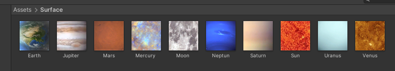
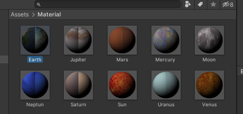
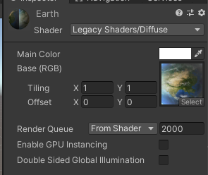
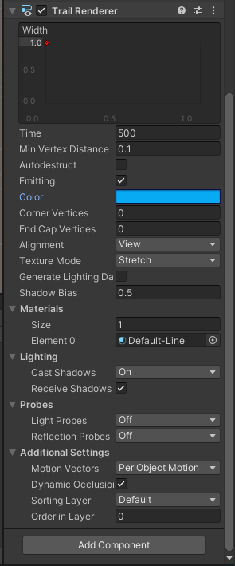

# 空间与运动

- [空间与运动](#空间与运动)
  - [1. 简答题](#1-简答题)
    - [Q1.1](#q11)
      - [平移](#平移)
      - [旋转](#旋转)
      - [缩放](#缩放)
    - [Q1.2](#q12)
      - [1. 直接设置物体位置](#1-直接设置物体位置)
      - [2. 设置 transform.Translate](#2-设置-transformtranslate)
      - [Vector.Slerp](#vectorslerp)
      - [Rigidbody](#rigidbody)
    - [Q1.3](#q13)
      - [1. 建立模型](#1-建立模型)
      - [2. 公转与自转](#2-公转与自转)
      - [查看效果](#查看效果)
  - [2. 编程实践](#2-编程实践)
  - [3. 思考题](#3-思考题)
    - [Rotate](#rotate)
    - [RotateAround](#rotatearound)

## 1. 简答题

### Q1.1

> 游戏对象运动的本质是什么？

本质上是通过**矩阵变换**来改变游戏对象的空间属性

#### 平移

```csharp
public class Translate : MonoBehaviour
{
  // 速度
  public float speed = 1;

  // 方向
  public Vector3 translation = Vector3.forward;

  void Update()
  {
    // 每秒更新一次位置
    transform.Translate(speed * Time.deltaTime * translation);
  }
}
```

#### 旋转

```csharp
public class Rotate : MonoBehaviour
{
  // 旋转速度
  public float speed = 5;

  // 方向
  public Vector3 axis = Vector3.forward;
  
  void Update()
  {
    transform.Rotate(axis, speed * Time.deltaTime);
  }
}
```

#### 缩放

```csharp
public class Zoom : MonoBehaviour
{
  void Update()
  {
    var x = Input.GetAxis("Horizontal") * Time.deltaTime; // 水平方向
    var z = Input.GetAxis("Vertical") * Time.deltaTime; // 垂直方向
    transform.localScale += new Vector3(x, 0, z);
  }
}
```

### Q1.2

> 请用三种方法以上方法，实现物体的抛物线运动。（如，修改 Transform 属性，使用向量 Vector3 的方法 …）

#### 1. 直接设置物体位置

以简单的抛物线运动 $y(x) = x^2$ 为例，直接设置物体在每次更新之后的**位置坐标**即可

```csharp
public class SetPositon : MonoBehaviour
{
  void Update ()
  {
    transform.position += Vector3.right * Time.deltaTime;
    transform.position = new Vector3(transform.position.x, transform.position.x * transform.position.x, 0);
  }
}
```

#### 2. 设置 transform.Translate

将抛物线分解为**水平方向**和**垂直方向**的位移，从而分别进行计算

```csharp
public class SetTranslate : MonoBehaviour
{
  private float t = 1; // 设置变化速率

  void Update ()
  {
    t += Time.deltaTime; // 当前时刻的垂直方向速度
    transform.Translate(Vector3.left * Time.deltaTime, Space.World); // 水平位移
    transform.Translate(Vector3.down * t * Time.deltaTime, Space.World); // 垂直位移
  }
}
```

#### Vector.Slerp

根据四元数的定义和作用，使用 `Vector.Slerp` 插值来进行实现

```csharp
public class SetSlerp : MonoBehaviour
{
  private float t = 1; // 变化速率

  void Update ()
  {
    t += Time.deltaTime;
    Vector3 next = transform.position + Vector3.left * Time.deltaTime + Vector3.down * t * Time.deltaTime; // 下一次的变化
    transform.position = Vector3.Slerp(transform.position, next, 1);
  }
}
```

#### Rigidbody

unity 自带了重力属性，因此可以设置游戏对象的**刚体属性**，使其受到重力得到垂直加速度，同时给以一个水平速度，从而达到抛物线运行的表现形式

```csharp
public class SetRigidbody : MonoBehaviour
{
  // Update is called once per frame.
  void Update ()
  {
    Rigidbody rb = gameObject.AddComponent<Rigidbody>(); // 设置为刚体

    rb.useGravity = true;           // 开启重力
    rb.velocity = Vector3.left * 4; // 水平速度
  }
}
```

### Q1.3

> 写一个程序，实现一个完整的太阳系， 其他星球围绕太阳的转速必须不一样，且不在一个法平面上

> 本项目使用 unity 2019.4.9f1 lts 版本

#### 1. 建立模型

从网上下载图片，如下：



并以此为基础，设置各个星球的 material ：



具体的 material 设置（例如地球）如下图：



根据太阳系中的各个行星的参数，创建不同的球体，给这些球体设置不同的参数，从而模拟太阳系：

> 为了满足轨迹的显示，需要给每个有公转的行星加上 Trail Renderer 组件，下图为水星轨迹设置：
>
> 

| 行星名称 | 大小 (x, y, z)             | 起始坐标 (x, y, z) |               轨迹颜色               |
| :------: | :------------------------- | :----------------- | :----------------------------------: |
|   Sun    | (0, 0, 0)                  | (30, 30, 30)       |                  无                  |
| Mercury  | (30, 0, 0)                 | (5,5,5)            |   |
|  Venus   | (50, 0, 0)                 | (6, 6, 6)          |     |
|  Earth   | (85, 0, 0)                 | (8, 8, 8)          |     |
|   Moon   | (1, 0, 0) *公转中心在地球* | (0.2, 0.2, 0.2)    |      |
|   Mars   | (115, 0, 0)                | (7, 7, 7)          |      |
| Jupiter  | (150, 0, 0)                | (10, 10, 10)       |   |
|  Saturn  | (190, 0, 0)                | (12, 12, 12)       |    |
|  Uranus  | (220, 0, 0)                | (13, 13, 13)       |  |
|  Neptun  | (250, 0, 0)                | (14, 14, 14)       |  |

#### 2. 公转与自转

> 为了简化操作，公转与自转代码都是采用随机数，从而使得多个星球绑定该脚本，并且获得不一样的数据，但是缺点是有随机性，无法体现太阳系自身特性

自转代码如下

```csharp
using System.Collections;
using System.Collections.Generic;
using UnityEngine;

public class Rotation : MonoBehaviour
{
  // Update is called once per frame
  void Update()
  {
    transform.RotateAround(transform.position, Vector3.up, Random.Range(1, 3));
  }
}
```

公转代码：

```csharp
using System.Collections;
using System.Collections.Generic;
using UnityEngine;

public class Revolution : MonoBehaviour
{
  public Transform center; // 公转中心，需要设置
  private float speed; // 速度
  private float x; // 用于设置法平面
  private float y; // 用于设置法平面

  // Start is called before the first frame update
  void Start()
  {
    speed = Random.Range(9, 12);
    x = Random.Range(-50, 50);
    y = Random.Range(-50, 50);
  }

  // Update is called once per frame
  void Update()
  {
    var axis = new Vector3(0, x, y);
    transform.RotateAround(center.position, axis, speed * Time.deltaTime);
  }
}
```

进行脚本绑定：
- 除了月亮和太阳自身之外，每个星球都有自己的公转和自转，公转中心绑定为太阳
- 月球只有公转，中心为地球
- 太阳只有自转

#### 查看效果

> 使用方法：
> 1. 点击下载[SolarSysyem 压缩包](./SolarSystem.zip)
> 2. 在 unity 中新建一个空白项目
> 3. 解压压缩包，打开 `SolarSystem` 文件夹，
> 4. 将 `Assets` 文件夹替换掉原本项目中的 Assets 文件夹
> 5. 打开 Assets 文件夹，将 Scenes 文件夹中的 SolarSystem 拖入场景中
> 6. 删除原本的场景
> 7. 点击运行便可以使用

运行效果如下

在 Game 中查看，效果如图  


## 2. 编程实践

[牧师与魔鬼项目文档](./doc.md)

## 3. 思考题

> 使用向量与变换，实现并扩展 Tranform 提供的方法，如 Rotate、RotateAround 等

### Rotate

代码如下：

```csharp
void Rotate(Transform t, Vector3 axis, float angle)
{
  var rot = Quaternion.AngleAxis(angle, axis); // 获取并生成四元数

  // 进行变换
  t.position *= rot;
  t.rotation *= rot;
}
```

### RotateAround

代码如下：

```csharp
void RotateAround(Transform t, Vector3 center, Vector3 axis, float angle)
{
  var position = t.position;
  var rot = Quaternion.AngleAxis(angle, axis);

  var direction = position - center;  // 两者插值，用于下一步进行变换
  direction = rot * direction;        // 方向
  t.position = center + direction;    // 得到新的位置
  t.rotation *= rot;                  // 新的旋转
}
```