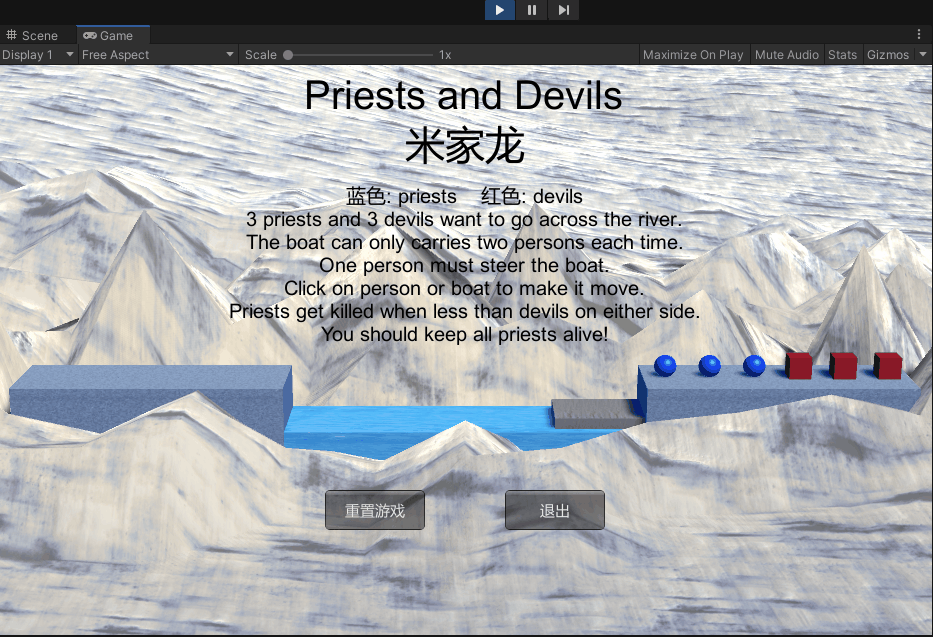

# 编程实践

> 牧师与魔鬼（动作分离版）
> - 附加条件：设计一个裁判类，当游戏达到结束条件时，通知场景控制器游戏结束

## 动作基类

动作基类需要用户实现**初始化动作**和**动作逻辑**，并且在动作执行完成后需要进行回调，用于处理完成之后的事件，具体代码如下：

```csharp
using System.Collections;
using System.Collections.Generic;
using UnityEngine;

namespace PriestsAndDevils
{
  public class Action : MonoBehaviour
  {

    public bool enable = true;
    public bool destroy = false; // 动作是否完成
    public GameObject gameObject { get; set; } // 需要进行运动的对象
    public Transform transform { get; set; }
    public IActionCallback callback; // 表示在动作执行完毕后，需要通知的对象

    // Start is called before the first frame update
    void Start()
    {
      // 提醒用户实现该方法
      throw new System.NotImplementedException();
    }

    // Update is called once per frame
    void Update()
    {
      // 提醒用户实现该方法
      throw new System.NotImplementedException();
    }
  }
}
```

其中 `IActionCallback` 是接口，定义如下：
```csharp
namespace PriestsAndDevils
{
  public interface IActionCallback
  {
    // 用于通知更高级对象动作已执行完毕。
    void ActionDone(Action action);
  }
}
```

### 基础动作

#### 直线运动

- 在静态方法中实现 `MoveToAction` 的创建
- 实现直线运动的逻辑

具体代码如下：
```csharp
using System.Collections;
using System.Collections.Generic;
using UnityEngine;

namespace PriestsAndDevils
{
  public class MoveToAction : Action
  {
    // 表示运动目的地。
    public Vector3 destination;
    // 表示运动速度。
    public float speed;

    // 创建 MoveToAction 。
    public static MoveToAction GetAction(GameObject gameObject, IActionCallback callback, Vector3 destination, float speed)
    {
      MoveToAction action = CreateInstance<MoveToAction>();
      // 设置需要进行直线运动的游戏对象。
      action.gameObject = gameObject;
      action.transform = gameObject.transform;
      action.callback = callback;
      // 设置直线运动的终点。
      action.destination = destination;
      // 设置直线运动的速度。
      action.speed = speed;
      return action;
    }

    public override void Start() { }

    // 在此方法中实现直线运动的逻辑。
    public override void Update()
    {
      transform.position = Vector3.MoveTowards(transform.position, destination, speed * Time.deltaTime);
      if (transform.position == destination)
      {
        destroy = true;
        callback?.ActionDone(this);
      }
    }
  }
}
```

### 顺序序列运动

由于上下船是两步动作，因此可以将其分解成：
- 横向直线运动
- 纵向直线运动
然后将这两个动作整合为一个动作，在此使用 `SequenceAction` 类来实现，具体代码如下：
```csharp
using System.Collections.Generic;
using UnityEngine;

namespace PriestsAndDevils
{
  public class SequenceAction : Action, IActionCallback
  {
    public List<Action> sequence; // 动作序列
    public int repeat = 1; // 重复次数
    public int currentActionIndex = 0; // 正在进行的动作

    // 创建 SequenceAction 。
    public static SequenceAction GetAction(IActionCallback callback, List<Action> sequence, int repeat = 1, int currentActionIndex = 0)
    {
      SequenceAction action = CreateInstance<SequenceAction>();
      action.callback = callback;
      action.sequence = sequence;
      action.repeat = repeat;
      action.currentActionIndex = currentActionIndex;
      return action;
    }

    // 设置每个子动作的回调
    // 子动作完成时，切换至下一动作。
    public override void Start()
    {
      foreach (Action action in sequence)
      {
        action.callback = this;
        action.Start();
      }
    }

    // 执行子动作。
    public override void Update()
    {
      if (sequence.Count == 0)
      {
        return;
      }
      if (currentActionIndex < sequence.Count)
      {
        sequence[currentActionIndex].Update();
      }
    }

    // 子动作完成时的钩子函数
    // 用于切换下一子动作。
    public void ActionDone(Action action)
    {
      action.destroy = false;
      currentActionIndex++;
      if (currentActionIndex >= sequence.Count)
      {
        currentActionIndex = 0;

        if (repeat > 0) // 判断是否需要重复执行。
        {
          repeat--;
        }
        if (repeat == 0)
        {
          destroy = true;
          callback?.ActionDone(this);
        }
      }
    }

    // 响应 Object 被销毁的事件。
    void OnDestroy()
    {
      foreach (Action action in sequence)
      {
        Destroy(action);
      }
    }
  }
}
```

## 动作管理

### 动作管理基类

> 用于管理所有的动作

具体代码如下：
```csharp
using System.Collections.Generic;
using UnityEngine;

namespace PriestsAndDevils
{
  public class ActionManager : MonoBehaviour, IActionCallback
  {
    // 存储所有动作。
    private Dictionary<int, Action> actions = new Dictionary<int, Action>();
    private List<Action> waitToAdd = new List<Action>();
    private List<int> waitToDelete = new List<int>();

    protected void Update()
    {
      foreach (Action action in waitToAdd)
      {
        actions[action.GetInstanceID()] = action;
      }
      waitToAdd.Clear();
      // 执行每一个动作。
      foreach (KeyValuePair<int, Action> kv in actions)
      {
        Action action = kv.Value;
        if (action.destroy)
        {
          waitToDelete.Add(action.GetInstanceID());
        }
        else if (action.enable)
        {
          action.Update();
        }
      }
      // 删除已完成的动作对应的数据结构。
      foreach (int k in waitToDelete)
      {
        Action action = actions[k];
        actions.Remove(k);
        Destroy(action);
      }
      waitToDelete.Clear();
    }

    // 添加动作。
    public void AddAction(Action action)
    {
      waitToAdd.Add(action);
      action.Start();
    }

    // 动作完成之后
    public void ActionDone(Action action) { }
  }
}
```

### 子类：具体管理

- 控制船只运动
- 控制人物运动

```csharp
using System.Collections.Generic;
using UnityEngine;

namespace PriestsAndDevils
{
  public class GameActionManager : ActionManager
  {
    // 移动船只。
    public void MoveBoat(BoatController boat)
    {
      // 创建船的直线运动。
      MoveToAction action = MoveToAction.GetAction(boat.gameObject, this, boat.GetDestination(), 20);
      AddAction(action);
    }

    // 移动人物。
    public void MoveCharacter(CharacterController character)
    {
      Vector3 destination = character.GetDestination();
      GameObject gameObject = character.gameObject;
      Vector3 currentPosition = character.transform.position;
      Vector3 pivotPosition = currentPosition; // 横向直线运动和纵向直线运动的转折点。

      if (destination.y > currentPosition.y)
      {
        pivotPosition.y = destination.y;
      }
      else
      {
        pivotPosition.x = destination.x;
      }
      // 创建序列动作来表示人物的折线运动：横向的直线运动、纵向的直线运动。
      Action action1 = MoveToAction.GetAction(gameObject, null, pivotPosition, 20);
      Action action2 = MoveToAction.GetAction(gameObject, null, destination, 20);
      SequenceAction action = SequenceAction.GetAction(this, new List<Action> { action1, action2 });
      AddAction(action);
    }
  }
}
```

## 裁判类

- 初始化船只、岸边的控制器
- 判定胜负（使用 `EventHandler`）

具体代码如下
```csharp
using System;
using UnityEngine;

namespace PriestsAndDevils
{
  // 游戏结果，判断是未结束（正在进行）还是输赢
  public enum Result
  {
    GAMING,
    WIN,
    LOSE,
  }

  public class Game
  {

    public Result result = Result.GAMING; // 游戏结果。
    private Boat boat;
    private Coast leftCoast;
    private Coast rightCoast;
    // 用于通知场景控制器游戏的胜负。
    public event EventHandler onChange;
    // 根据传入的控制器生成裁判类。
    public Game(Boat boat, Coast leftCoast, Coast rightCoast)
    {
      this.boat = boat;
      this.leftCoast = leftCoast;
      this.rightCoast = rightCoast;
    }

    // It determines whether the player wins the game.
    public void CheckWinner()
    {
      result = Result.GAMING;

      // 计算成员组成
      int leftPriests = leftCoast.GetCharacterAmount()[0];
      int leftDevils = leftCoast.GetCharacterAmount()[1];
      int rightPriests = rightCoast.GetCharacterAmount()[0];
      int rightDevils = rightCoast.GetCharacterAmount()[1];

      // 如果所有牧师都在边上
      if (leftPriests + leftDevils == 6)
      {
        result = Result.WIN;
      }
      // 船在右边
      if (boat.location == Location.Right)
      {
        rightPriests += boat.GetCharacterAmount()[0];
        rightDevils += boat.GetCharacterAmount()[1];
      }
      else // 船左边
      {
        leftPriests += boat.GetCharacterAmount()[0];
        leftDevils += boat.GetCharacterAmount()[1];
      }
      // 失败
      if ((rightPriests < rightDevils && rightPriests > 0) ||
          (leftPriests < leftDevils && leftPriests > 0))
      {
        result = Result.LOSE;
      }
      // 通知场景控制器。
      onChange?.Invoke(this, EventArgs.Empty);
    }
  }
}
```

## 使用方法以及效果

### 使用方法

使用方法：
1. 点击下载[PriestAndDevil 压缩包（140MB）](https://github.91chifun.workers.dev//https://github.com/FFFengMJL/unity-learning/releases/download/0.0.4/PriestAndDevil.zip)
2. 在 unity 中新建一个空白项目
3. 解压压缩包，打开 `PriestAndDevil` 文件夹，
4. 将 `Assets` 文件夹替换掉原本项目中的 Assets 文件夹
5. 打开 Assets 文件夹，将 Scenes 文件夹中的 PriesteAndDevil 拖入场景中
6. 删除原本的场景
7. 点击运行便可以使用

### 效果

- 失败：



- 重置和退出游戏

