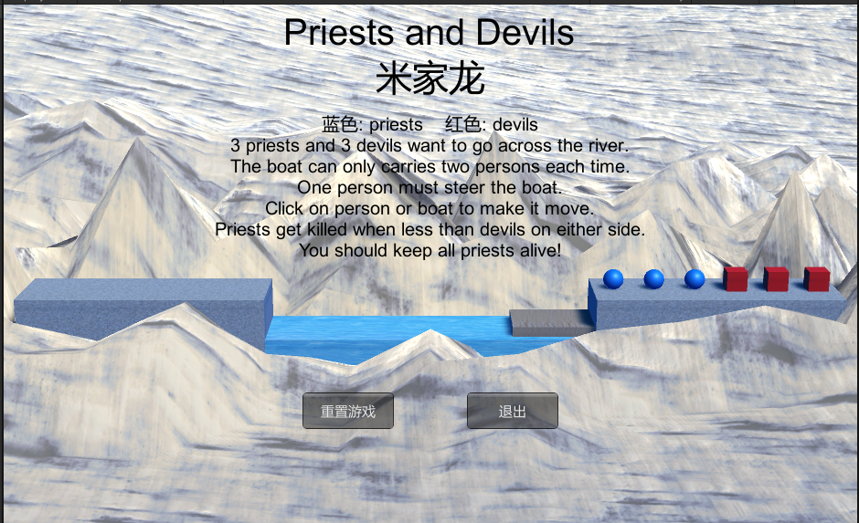
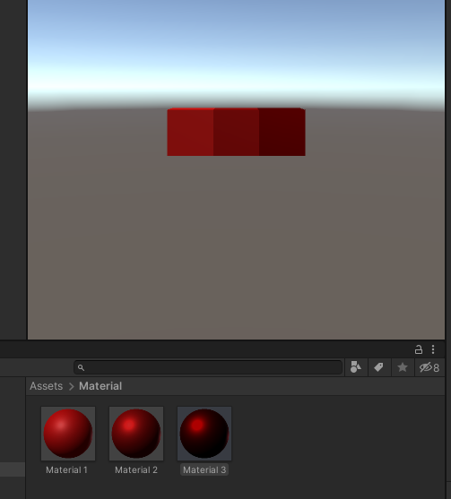
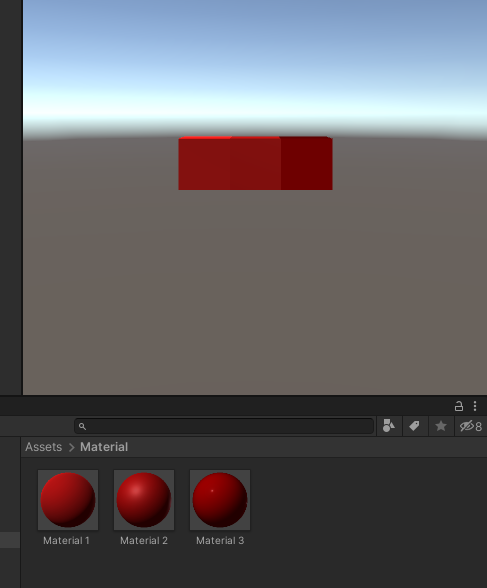
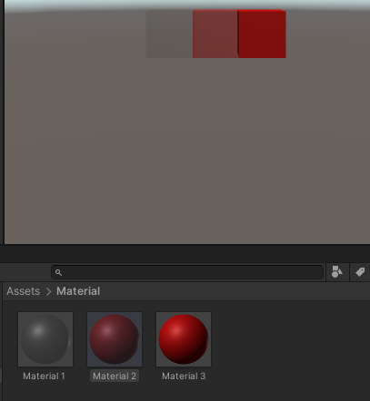

# 游戏对象与图形基础

- [游戏对象与图形基础](#游戏对象与图形基础)
  - [1. 基本操作演练](#1-基本操作演练)
    - [构建场景](#构建场景)
    - [总结游戏对象](#总结游戏对象)
  - [2. 编程实践](#2-编程实践)
  - [3. 材料与渲染练习](#3-材料与渲染练习)
    - [Standard Shader 自然场景渲染器](#standard-shader-自然场景渲染器)

## 1. 基本操作演练

### 构建场景

> 下载 Fantasy Skybox FREE， 构建自己的游戏场景 

使用该库中的 Sample Terrian ，略作修改，构成下面项目的游戏场景，具体如下图

### 总结游戏对象

> 写一个简单的总结，总结游戏对象的使用

游戏对象大致分为三类：
- 摄像头/光源这种给场景提供交互方式和渲染的辅助对象
- 3D/2D等游戏实体对象，这些对象一般完成游戏中场景和角色的构成
- 材质、地表等，这些一般不会直接显示，而是附加在场景/实体对象中，来进行游戏美化

游戏对象可以通过直接实例化，在添加其他的设置，也可以使用预设的方式来方便构建大量相同的游戏对象

玩家与游戏对象之间的交互与其自身的运动，一般通过挂载编写的脚本来实现

## 2. 编程实践

[项目文档](doc.md)

## 3. 材料与渲染练习

### Standard Shader 自然场景渲染器

> - 阅读官方 [Standard Shader](https://docs.unity3d.com/cn/2019.4/Manual/shader-StandardShader.html) 手册
> - 选择合适内容，如 [Albedo Color and Transparency](https://docs.unity3d.com/cn/2019.4/Manual/StandardShaderMaterialParameterAlbedoColor.html) ，寻找合适素材，用博客展示相关效果的呈现

游戏物体表面的显示表示，使用的是**三角网格**，与之相关的有：
- Mesh 部件：物体表面的三角网格，和物体形状的构建有关
- Mesh Render 部件：用于渲染表面和色彩

通过 `Albedo` 设置表面颜色，rgb 为 *FF0000*
- 修改 Metallic 的值，分别为0、0.5、1，效果如下图：

- 修改 Smoothness 的值，分别为0、0.5、1，效果如下图：

- 修改模式为 Transparent ，修改 Albedo 的 a 值（透明度），具体效果如下图：

