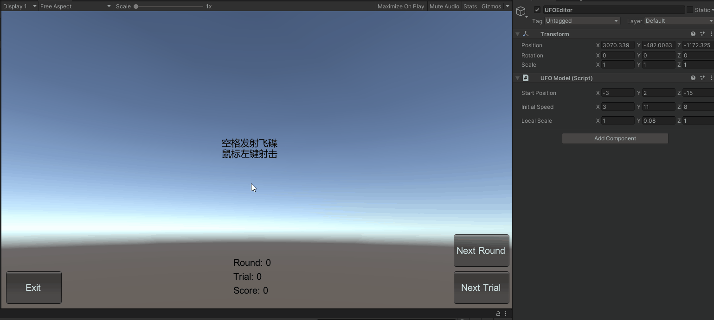

# 与游戏世界交互

- [与游戏世界交互](#与游戏世界交互)
  - [1. 编写鼠标游戏](#1-编写鼠标游戏)
    - [规则设计](#规则设计)
    - [MVC 架构](#mvc-架构)
      - [裁判类](#裁判类)
    - [飞碟类](#飞碟类)
    - [GameGUI](#gamegui)
    - [场景控制类](#场景控制类)
    - [导演类](#导演类)
    - [场景控制类](#场景控制类-1)
    - [Ruler 类](#ruler-类)
    - [飞碟工厂](#飞碟工厂)
  - [2. 编写一个简单的自定义 Component](#2-编写一个简单的自定义-component)
  - [效果和使用方法](#效果和使用方法)

## 1. 编写鼠标游戏

- 游戏内容要求：
  - 游戏有 n 个 round，每个 round 都包括10次 trial；
  - 每个 trial 的飞碟的色彩、大小、发射位置、速度、角度、同时出现的个数都可能不同。它们由该 round 的 ruler 控制；
  - 每个 trial 的飞碟有随机性，总体难度随 round 上升；
  - 鼠标点中得分，得分规则按色彩、大小、速度不同计算，规则可自由设定。
- 游戏的要求：
  - 使用带缓存的工厂模式管理不同飞碟的生产与回收，该工厂必须是场景单实例的！具体实现见参考资源 Singleton 模板类
  - 尽可能使用前面 MVC 结构实现人机交互与游戏模型分离

### 规则设计

- Round: 5
- Trial: 5
- 发射飞碟：*空格键*触发
- 得分：*射击*飞碟
- 扣分：飞碟落地/离开视野
- 胜利条件：完成所有 Round 的 Trial 并且分数*不为负数*
- 失败条件：任意时刻分数为*负数*

### MVC 架构

具体架构如下：
- Model
  - GameModel: 裁判类，负责管理 Round、 Trial 和判断胜负
  - UFOMode：飞碟，有位置、速度、大小三个属性
- View
  - GameGUI: 游戏界面（按钮和文字提示）
- Controller
  - Director：导演（单例），控制场景切换
  - GameController：场景控制
  - Ruler：控制飞碟的各种属性
  - UFOFactory：飞碟工厂，用于生成和回收飞碟对象
- 拓展 Editors
  - UFOEditor: 用于自定义飞碟位置、速度、大小

#### 裁判类

裁判类需要负责管理：
- 当前游戏状态
- 整个游戏的最大 Round 和 Trial
- 当前游戏的 Round 和 Trail
- 当前分数

具体代码如下：
```csharp
public enum GameState
{
  Running, // 正在进行
  Lose, // 玩家失败
  Win // 玩家胜利
}

public enum SceneState
{
  Waiting, // 等待用户按下空格键
  Shooting // 等待用户点击鼠标左键
}

public class GameModel
{
  public GameState game = GameState.Running; // 当前游戏状态 运行中 | 胜利 | 失败
  public SceneState scene = SceneState.Waiting; // 当前场景状态 等待空格 | 等待鼠标左键
  public EventHandler onRefresh; // 场景控制器更新游戏画面
  public EventHandler onEnterNextRound; // 场景控制器更新 Ruler
  public readonly int maxRound = 5; // 最大 Round 数
  public readonly int maxTrial = 5; // 最大 Trial 数
  public int currentRound { get; private set; } = 0; // 当前 Round
  public int currentTrial { get; private set; } = 0; // 当前 Trial
  public int score { get; private set; } = 0; // 当前分数

  // 重置裁判类
  public void Reset(GameState _game = GameState.Running)
  {
    game = _game;
    scene = SceneState.Waiting;
    currentRound = 0;
    currentTrial = 0;
    score = 0;
    onRefresh.Invoke(this, EventArgs.Empty); // 需要重置游戏画面
    onEnterNextRound.Invoke(this, EventArgs.Empty); // 需要重置 Ruler
  }

  // 进入下一 Round
  public void NextRound()
  {
    ++currentRound;
    if (currentRound == maxRound)
    {
      Reset(GameState.Win);
    }
    else
    {
      onRefresh.Invoke(this, EventArgs.Empty);
      onEnterNextRound.Invoke(this, EventArgs.Empty);
    }
  }

  // 进入下一 Trial
  public void NextTrial()
  {
    ++currentTrial;
    if (currentTrial == maxTrial)
    {
      currentTrial = 0;
      ++currentRound;
      // 检测玩家是否胜利。
      if (currentRound == maxRound)
      {
        Reset(GameState.Win);
      }
      else
      {
        onEnterNextRound.Invoke(this, EventArgs.Empty);
      }
    }
    onRefresh.Invoke(this, EventArgs.Empty);
  }

  // 增加玩家分数
  public void AddScore(int score)
  {
    this.score += score;
    // 通知场景控制器需要更新游戏画面
    onRefresh.Invoke(this, EventArgs.Empty);
  }

  // 扣除玩家分数
  public void SubScore()
  {
    this.score -= (currentRound + 1) * 10;
    // 检测玩家是否失败
    if (score < 0)
    {
      Reset(GameState.Lose);
    }
    onRefresh.Invoke(this, EventArgs.Empty);
  }
}
```

### 飞碟类

飞碟需要这些属性：
- 分数
- 初始位置
- 初始速度
- 大小
- 刚体（一定要）

具体代码如下：
```csharp
public class UFOModel : MonoBehaviour
{
  // 记录当前飞碟的分数
  public int score; // 飞碟分数
  public static Vector3 startPosition = new Vector3(-3, 2, -15); // 初始位置（左边）
  public static Vector3 startSpeed = new Vector3(3, 11, 8); // 初始速度
  public static Vector3 localScale = new Vector3(1, 0.08f, 1); // 初始大小
  private int leftOrRight; // 飞碟位置 左 | 右

  // 获取速度
  public Vector3 GetSpeed()
  {
    Vector3 v = startSpeed;
    v.x *= leftOrRight;
    return v;
  }

  // 设置初始位置
  public void SetSide(int lr, float dy)
  {
    Vector3 v = startPosition;
    v.x *= lr;
    v.y += dy;
    transform.position = v;
    leftOrRight = lr;
  }

  // 设置大小
  public void SetLocalScale(float x, float y, float z)
  {
    Vector3 lc = localScale;
    lc.x *= x;
    lc.y *= y;
    lc.z *= z;
    transform.localScale = lc;
  }
}
```

### GameGUI

这个类主要负责：
- 按钮
  - 退出按钮
  - 重新开始按钮
  - 下一 Round 按钮
  - 下一 Trial 按钮
- 文本提示
  - 当前分数
  - 当前 Round
  - 当前 Trial
  - 操作提示

具体代码如下：
```csharp
public class GameGUI : MonoBehaviour
{
  public GameState state;
  public int round = 0;
  public int trial = 0;
  public int score = 0;

  public EventHandler onPressRestartButton;
  public EventHandler onPressNextRoundButton;
  public EventHandler onPressNextTrialButton;

  void OnGUI()
  {
    var textStyle = new GUIStyle()
    {
      fontSize = 20
    };

    // Round、Trial 、分数相关信息显示
    GUI.Label(new Rect(Screen.width / 2 - 50, Screen.height - 110, 200, 100), "Round: " + round, textStyle);
    GUI.Label(new Rect(Screen.width / 2 - 50, Screen.height - 80, 200, 100), "Trial: " + trial, textStyle);
    GUI.Label(new Rect(Screen.width / 2 - 50, Screen.height - 50, 200, 100), "Score: " + score, textStyle);

    // 胜利和失败页面。
    if (state != GameState.Running)
    {
      var text = state == GameState.Win ? "You Win!" : "You Lose!";
      GUI.Label(new Rect(Screen.width / 2 - 50, Screen.height / 2 - 50, 100, 50), text, new GUIStyle() { fontSize = 40, alignment = TextAnchor.MiddleCenter });

      // restart 按钮
      if (GUI.Button(new Rect(Screen.width / 2 - 70, Screen.height / 2, 140, 70), "Restart", new GUIStyle("button") { fontSize = 30 }))
      {
        onPressRestartButton.Invoke(this, EventArgs.Empty);
      }
    }

    // 操作提示
    const string ruleString = "空格发射飞碟\n鼠标左键射击";
    if (state == GameState.Running)
    {
      GUI.Label(new Rect(Screen.width / 2 - 65, Screen.height / 2 - 50, 100, 50), ruleString, new GUIStyle { fontSize = 20, alignment = TextAnchor.MiddleCenter });
    }

    // 退出按钮
    if (GUI.Button(new Rect(10, Screen.height - 80, 120, 70), "Exit", new GUIStyle("button") { fontSize = 20, alignment = TextAnchor.MiddleCenter }))
    {
#if UNITY_EDITOR
      UnityEditor.EditorApplication.isPlaying = false;
#else
      Application.Quit();
#endif
    }

    // NextRound 按钮，自定义 Round
    if (GUI.Button(new Rect(Screen.width - 125, Screen.height - 160, 120, 70), "Next Round", new GUIStyle("button") { fontSize = 20, alignment = TextAnchor.MiddleCenter }))
    {
      onPressNextRoundButton.Invoke(this, EventArgs.Empty);
    }

    // NextTrial 按钮，自定义 Trial
    if (GUI.Button(new Rect(Screen.width - 125, Screen.height - 80, 120, 70), "Next Trial", new GUIStyle("button") { fontSize = 20, alignment = TextAnchor.MiddleCenter }))
    {
      onPressNextTrialButton.Invoke(this, EventArgs.Empty);
    }
  }
}
```

> 在该类中，我使用了三个 `EventHanlder` ，用于将事件通知给 `GameController` ，从而实现对应的功能，从而实现事件的解耦合

### 场景控制类

在这个类中，我们需要实现：
- 射击动作（鼠标左键触发）
- 发射飞碟动作（空格键触发）
- 其他游戏相关的设置
- 游戏画面的更新

具体代码如下：
```csharp
public class GameController : MonoBehaviour, ISceneController
{
  private GameModel model = new GameModel();
  private GameGUI view;
  private Ruler ruler;

  private List<GameObject> UFOs = new List<GameObject>();

  void Awake()
  {
    Director.GetInstance().OnSceneWake(this);
    view = gameObject.AddComponent<GameGUI>();
    view.onPressRestartButton += delegate
    {
      model.Reset();
    };
    view.onPressNextRoundButton += delegate
    {
      if (model.game == GameState.Running)
      {
        model.NextRound();
      }
    };
    view.onPressNextTrialButton += delegate
    {
      if (model.game == GameState.Running)
      {
        model.NextTrial();
      }
    };
    ruler = new Ruler(model.currentRound);

    // 更新游戏画面
    model.onRefresh += delegate
    {
      view.state = model.game;
      view.round = model.currentRound;
      view.trial = model.currentTrial;
      view.score = model.score;
    };

    // 更新 Ruler
    model.onEnterNextRound += delegate
    {
      ruler = new Ruler(model.currentRound);
    };
  }

  void Update()
  {
    var invisibleUFOs = UFOs.FindAll(x => x.transform.position.y <= -10f); // 不可见的飞碟
    // 所有不可见的飞碟都要进行回收
    foreach (var ufo in invisibleUFOs)
    {
      OnMissUFO(ufo);
    }

    if (model.game == GameState.Running)
    {
      // 射击飞碟
      if (model.scene == SceneState.Shooting && Input.GetButtonDown("Fire1"))
      {
        // 光标拾取单个游戏对象
        // 构建射线
        Ray ray = Camera.main.ScreenPointToRay(Input.mousePosition);
        // 当射线与飞碟碰撞时，即说明我们想用鼠标点击此飞碟
        if (Physics.Raycast(ray, out RaycastHit hit) && hit.collider.gameObject.tag == "UFO")
        {
          OnHitUFO(hit.collider.gameObject);
        }
      }

      // 发射飞碟
      if (model.scene == SceneState.Waiting && Input.GetKeyDown("space"))
      {
        model.scene = SceneState.Shooting;
        model.NextTrial();

        // 若玩家满足胜利条件，按下空格不发射飞碟
        if (model.game == GameState.Win)
        {
          return;
        }
        UFOs.AddRange(ruler.GetUFOs());
      }

      // 没有 UFO 在界面上
      if (UFOs.Count == 0)
      {
        model.scene = SceneState.Waiting;
      }
    }

  }

  // 由于场景并无需要初始化的资源，故函数体为空
  public void LoadResources() { }

  // 在用户成功点击飞碟后被触发
  private void OnHitUFO(GameObject ufo)
  {
    model.AddScore(ufo.GetComponent<UFOModel>().score); // 增加分数
    DestroyUFO(ufo); // 回收飞碟对象
  }

  // miss 后触发
  private void OnMissUFO(GameObject ufo)
  {
    model.SubScore(); // 减去分数
    DestroyUFO(ufo); // 回收飞碟对象
  }

  // 回收飞碟对象
  private void DestroyUFO(GameObject ufo)
  {
    UFOs.Remove(ufo);
    UFOFactory.GetInstance().Put(ufo); // 工厂模式的回收方法。
  }
}
```

### 导演类

这个没什么好说的，具体代码如下：
```csharp
public class Director : System.Object
{
  private static Director instance; // 唯一实例
  public ISceneController currentSceneController { get; private set; }
  public bool running { get; set; }
  public int fps
  {
    get { return Application.targetFrameRate; }
    set { Application.targetFrameRate = value; }
  }

  // 单例要求
  public static Director GetInstance()
  {
    return instance ?? (instance = new Director());
  }

  public void OnSceneWake(ISceneController controller)
  {
    currentSceneController = controller;
    controller.LoadResources();
  }
}
```

### 场景控制类

该类需要负责在 GUI 类中的事件处理，以及飞碟的相关的操作

具体代码如下：
```csharp
public class GameController : MonoBehaviour, ISceneController
{
  private GameModel model = new GameModel();
  private GameGUI view;
  private Ruler ruler;
  private List<GameObject> UFOs = new List<GameObject>();

  void Awake()
  {
    Director.GetInstance().OnSceneWake(this);
    view = gameObject.AddComponent<GameGUI>();

    // 重新开始
    view.onPressRestartButton += delegate
    {
      model.Reset();
    };

    // 下一 Round
    view.onPressNextRoundButton += delegate
    {
      if (model.game == GameState.Running)
      {
        model.NextRound();
      }
    };

    // 下一 Trial
    view.onPressNextTrialButton += delegate
    {
      if (model.game == GameState.Running)
      {
        model.NextTrial();
      }
    };
    ruler = new Ruler(model.currentRound);

    // 更新游戏画面
    model.onRefresh += delegate
    {
      view.state = model.game;
      view.round = model.currentRound;
      view.trial = model.currentTrial;
      view.score = model.score;
    };

    // 更新 Ruler
    model.onEnterNextRound += delegate
    {
      ruler = new Ruler(model.currentRound);
    };
  }

  void Update()
  {
    var invisibleUFOs = UFOs.FindAll(x => x.transform.position.y <= -10f); // 不可见的飞碟
    // 所有不可见的飞碟都要进行回收
    foreach (var ufo in invisibleUFOs)
    {
      OnMissUFO(ufo);
    }

    if (model.game == GameState.Running)
    {
      // 射击飞碟
      if (model.scene == SceneState.Shooting && Input.GetButtonDown("Fire1"))
      {
        // 光标拾取单个游戏对象
        // 构建射线
        Ray ray = Camera.main.ScreenPointToRay(Input.mousePosition);
        // 当射线与飞碟碰撞时，即说明我们想用鼠标点击此飞碟
        if (Physics.Raycast(ray, out RaycastHit hit) && hit.collider.gameObject.tag == "UFO")
        {
          OnHitUFO(hit.collider.gameObject);
        }
      }

      // 发射飞碟
      if (model.scene == SceneState.Waiting && Input.GetKeyDown("space"))
      {
        model.scene = SceneState.Shooting;
        model.NextTrial();

        // 若玩家满足胜利条件，按下空格不发射飞碟
        if (model.game == GameState.Win)
        {
          return;
        }
        UFOs.AddRange(ruler.GetUFOs());
      }

      // 没有 UFO 在界面上
      if (UFOs.Count == 0)
      {
        model.scene = SceneState.Waiting;
      }
    }

  }

  // 由于场景并无需要初始化的资源，故函数体为空
  public void LoadResources() { }

  // 在用户成功点击飞碟后被触发
  private void OnHitUFO(GameObject ufo)
  {
    model.AddScore(ufo.GetComponent<UFOModel>().score); // 增加分数
    DestroyUFO(ufo); // 回收飞碟对象
  }

  // miss 后触发
  private void OnMissUFO(GameObject ufo)
  {
    model.SubScore(); // 减去分数
    DestroyUFO(ufo); // 回收飞碟对象
  }

  // 回收飞碟对象
  private void DestroyUFO(GameObject ufo)
  {
    UFOs.Remove(ufo);
    UFOFactory.GetInstance().Put(ufo); // 工厂模式的回收方法。
  }
}
```

### Ruler 类

该类是用于协助上一个类，管理飞碟相关的属性，和随机生成飞碟有关

```csharp
public class Ruler
{
  private readonly int currentRound;
  private System.Random random; // 随机生成
  private static Array colors = Enum.GetValues(typeof(UFOFactory.Color)); // 抽颜色池子
  private static int[] UFOCount = { 1, 3, 4, 5, 6, 6, 8, 8, 8, 9 }; // 数量池子
  private static int[] score = { 1, 5, 10 }; // 分数池子
  private static float[] speed = { 0.5f, 0.6f, 0.7f }; // 速度池子
  private static float[] scale = { 2f, 1.5f, 1f }; // 飞碟大小池子

  public Ruler(int currentRound)
  {
    this.currentRound = currentRound;
    this.random = new System.Random();
  }

  public int GetUFOCount()
  {
    return UFOCount[currentRound];
  }

  // 获取并发射飞碟
  public List<GameObject> GetUFOs()
  {
    List<GameObject> ufos = new List<GameObject>();

    // 随机生成颜色。
    var index = random.Next(colors.Length);
    var color = (UFOFactory.Color)colors.GetValue(index);

    // 当前 Round 下飞碟产生数。
    var count = GetUFOCount();

    for (int i = 0; i < count; ++i)
    {
      // 调用工厂方法，获取特定颜色的飞碟对象。
      var ufo = UFOFactory.GetInstance().Get(color);

      // 设置飞碟对象的分数。
      var model = ufo.GetComponent<UFOModel>();
      model.score = score[index] * (currentRound + 1);

      // 设置缩放比例。
      model.SetLocalScale(scale[index], 1, scale[index]);

      // 设置初始位置（随机左边、右边）。
      var leftOrRight = (random.Next() & 2) - 1; // 随机生成 1 或 -1 。
      model.SetSide(leftOrRight, i);

      // 设置飞碟对象的刚体属性，和初始力方向。
      var rigidbody = ufo.GetComponent<Rigidbody>();
      rigidbody.AddForce(0.2f * speed[index] * model.GetSpeed(), ForceMode.Impulse);
      rigidbody.useGravity = true;
      ufos.Add(ufo);
    }

    return ufos;
  }
}
```

### 飞碟工厂

该类主要用于：
- 创建飞碟
- 回收飞碟

```csharp
// 游戏工厂
public class UFOFactory
{
  // 定义飞碟颜色。
  public enum Color
  {
    Red,
    Green,
    Blue
  }

  private static UFOFactory factory; // 单例
  private List<GameObject> inUsed = new List<GameObject>(); // 正在使用的飞碟（需要维护）
  private List<GameObject> notUsed = new List<GameObject>(); // 未被使用的飞碟（需要维护）
  private readonly Vector3 invisible = new Vector3(0, -100, 0); // 空闲飞碟的位置

  // 用于满足单例要求
  public static UFOFactory GetInstance()
  {
    return factory ?? (factory = new UFOFactory());
  }

  // 获取特定颜色的飞碟。
  public GameObject Get(Color color)
  {
    GameObject ufo;

    // 决定是否生产
    if (notUsed.Count == 0)
    {
      ufo = Object.Instantiate(Resources.Load<GameObject>("Prefabs/UFO"), invisible, Quaternion.identity);
      ufo.AddComponent<UFOModel>();
    }
    else
    {
      ufo = notUsed[0];
      notUsed.RemoveAt(0);
    }

    // 设置颜色
    Material material = Object.Instantiate(Resources.Load<Material>("Materials/" + color.ToString("G")));
    ufo.GetComponent<MeshRenderer>().material = material;

    // 添加对象至 inUsed 列表
    inUsed.Add(ufo);
    return ufo;
  }

  // 回收飞碟对象。
  public void Put(GameObject ufo)
  {
    // 设置飞碟对象的空间位置和刚体属性。
    var rigidbody = ufo.GetComponent<Rigidbody>();

    // 需要设置回收对象速度为0
    rigidbody.velocity = Vector3.zero;
    rigidbody.angularVelocity = Vector3.zero;
    rigidbody.useGravity = false;
    ufo.transform.position = invisible;

    // 维护 inUsed 和 notUsed 列表。
    inUsed.Remove(ufo);
    notUsed.Add(ufo);
  }
}
```

## 2. 编写一个简单的自定义 Component

为了方便自定义飞碟，因此加入了一个 `UFOEditor` 类，用于控制飞碟的相关属性（起始位置、初始速度和大小，具体代码如下：
```csharp
using UnityEditor;
using UnityEngine;

namespace HitUFO
{
  [CustomEditor(typeof(UFOModel))]
  public class UFOEditor : Editor
  {
    public override void OnInspectorGUI()
    {
      var target = (UFOModel)serializedObject.targetObject;

      // 初始位置
      EditorGUILayout.Space();
      Vector3 startPosition = EditorGUILayout.Vector3Field("Start Position", UFOModel.startPosition);
      UFOModel.startPosition = startPosition;

      // 初始速度
      EditorGUILayout.Space();
      Vector3 startSpeed = EditorGUILayout.Vector3Field("Initial Speed", UFOModel.startSpeed);
      UFOModel.startSpeed = startSpeed;

      // 初始大小
      EditorGUILayout.Space();
      Vector3 localScale = EditorGUILayout.Vector3Field("Local Scale", UFOModel.localScale);
      UFOModel.localScale = localScale;
    }
  }
}
```

将其挂载到新建的空游戏对象 UFOEditor 上，在游戏运行中便可以实时调整飞碟属性

## 效果和使用方法

使用方法：
1. 点击下载[HitUFO 压缩包（25.6MB）](https://github.91chifun.workers.dev//https://github.com/FFFengMJL/unity-learning/releases/download/0.0.5/HitUFO.zip)
2. 在 unity 中新建一个空白项目
3. 解压压缩包，打开 `HitUFO` 文件夹，
4. 将 `Assets` 文件夹替换掉原本项目中的 Assets 文件夹
5. 打开 Assets 文件夹，将 Scenes 文件夹中的 HitUFO 拖入场景中
6. 删除原本的场景
7. 点击运行便可以使用

完整的运行效果如下：


使用自定义组件的效果如图

