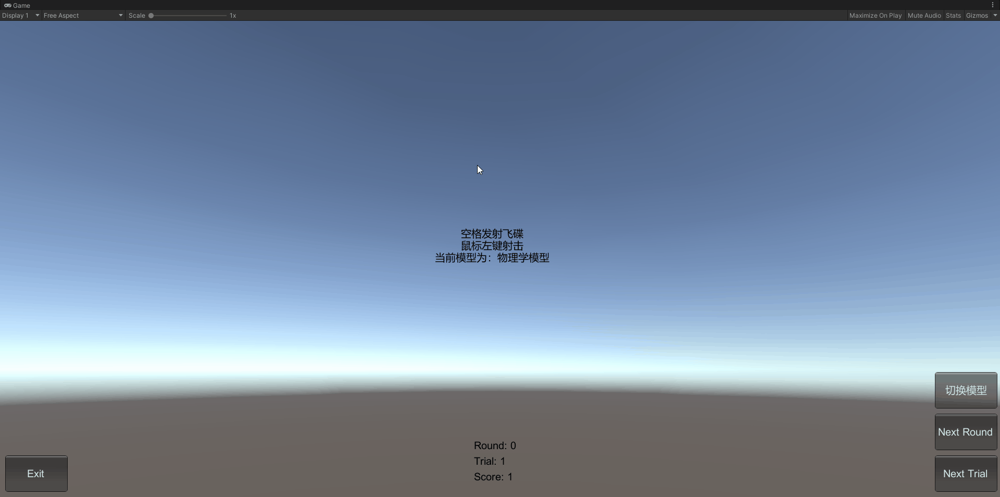

# 物理系统与碰撞

- [物理系统与碰撞](#物理系统与碰撞)
  - [Adapter 接口](#adapter-接口)
  - [模型](#模型)
    - [物理运动模型](#物理运动模型)
    - [运动学模型](#运动学模型)
    - [其他相关更新](#其他相关更新)
      - [UFOModel](#ufomodel)
      - [Ruler](#ruler)
      - [GameController](#gamecontroller)
  - [效果和使用方法](#效果和使用方法)

> 改进飞碟（Hit UFO）游戏：
> 游戏内容要求：
> - 按 adapter 模式设计图修改飞碟游戏
> - 使它同时支持物理运动与运动学（变换）运动

## Adapter 接口

定义接口 `IActionManager` ，用于设置游戏对象的运动学模型，具体代码如下：
```csharp
using UnityEngine;

namespace HitUFO
{
  public interface ISceneController
  {
    void LoadResources();
  }

  // 新增接口，用于设置运动学模型
  public interface IActionManager
  {
    // 设置运动学模型
    void SetAction(GameObject ufo);
  }
}
```

## 模型

为了同时支持物理运动和运动学（变换）运动，新增了两个类，分别是 `CCActionManager` 和 `PhysicActionManager`

### 物理运动模型

> 物理运动学模型即上次作业中的要求，因此只需要将其从相关代码提出，并进行重构即可。
 
`PhysicActionManager` 类具体代码如下：
```csharp
using UnityEngine;

namespace HitUFO
{
  public class PhysicActionManager : IActionManager
  {
    public void SetAction(GameObject ufo)
    {
      var model = ufo.GetComponent<UFOModel>();
      var rigidbody = ufo.GetComponent<Rigidbody>();

      // 对物体添加 Impulse 力
      rigidbody.AddForce(0.2f * model.GetSpeed(), ForceMode.Impulse);
      rigidbody.useGravity = true;
    }
  }
}
```

### 运动学模型

具体代码如下：
```csharp
using System.Collections;
using System.Collections.Generic;
using UnityEngine;

namespace HitUFO
{
  public class CCActionManager : IActionManager
  {
    private class CCAction : MonoBehaviour
    {
      void Update()
      {
        // 当飞碟被回收时，销毁该模型
        if (transform.position == UFOFactory.invisible)
        {
          Destroy(this);
        }

        var model = gameObject.GetComponent<UFOModel>();
        transform.position = Vector3.MoveTowards(transform.position, new Vector3(-3f + model.GetId() * 2f, 10f, -2f), 5 * Time.deltaTime);
      }
    }

    public void SetAction(GameObject ufo)
    {
      // 预设使用了 Rigidbody 需要取消重力设置
      ufo.GetComponent<Rigidbody>().useGravity = false;

      // 添加运动学（转换）运动。
      ufo.AddComponent<CCAction>();
    }
  }
}
```

### 其他相关更新

#### UFOModel

- 新增 `speedScale` 和 `id` 变量，和相关方法
  - `GetId`
  - `SetSpeedScale`
  - `SetSide`
  - `SetId`
- 更新 `GetSpeed` 方法

```csharp
using UnityEngine;

namespace HitUFO
{
  public class UFOModel : MonoBehaviour
  {
    ......

    private float speedScale = 1; // 速度比例
    private int id; // 标识符

    // 获取速度
    public Vector3 GetSpeed()
    {
      Vector3 v = (this.speedScale) * startSpeed;
      v.x *= leftOrRight;
      return v;
    }

    // 获取 id
    public int GetId()
    {
      return this.id;
    }

    // 设置速度比例
    public void SetSpeedScale(float scale)
    {
      this.speedScale = scale;
    }

    // 设置初始位置
    public void SetSide(int lr)
    {
      Vector3 v = startPosition;
      v.x *= lr;
      v.y += GetId();
      transform.position = v;
      leftOrRight = lr;
    }


    // 设置大小
    public void SetLocalScale(float x, float y, float z)
    {
      ......
    }

    // 设置 id
    public void SetId(int id)
    {
      this.id = id;
    }
  }
}
```

#### Ruler

- 添加 `actionManager` 变量，用于设置相关模型
- 更新 `GetUFO` 函数，在生成 UFO 的过程中增加了其他参数的设置

```csharp
using System;
using System.Collections.Generic;
using UnityEngine;

namespace HitUFO
{
  public class Ruler
  {
    ......
    private IActionManager actionManager; // 运动学模型


    public Ruler(int currentRound, IActionManager actionManager)
    {
      this.currentRound = currentRound;
      this.random = new System.Random();

      // 设置运动学模型
      this.actionManager = actionManager;
    }

    public int GetUFOCount()
    {
      ......
    }

    // 获取并发射飞碟
    public List<GameObject> GetUFOs()
    {
      ......

      for (int i = 0; i < count; ++i)
      {
        ......

        // 设置初始位置（随机左边、右边）。
        var leftOrRight = (random.Next() & 2) - 1; // 随机生成 1 或 -1 。
        model.SetSide(leftOrRight);

        // 设置速度比例
        model.SetSpeedScale(speed[index]);

        // 设置 id
        model.SetId(i);

        // 设置运动学模型
        actionManager.SetAction(ufo);

        // 添加到队列中
        ufos.Add(ufo);
      }

      return ufos;
    }
  }
}
```

#### GameController

- 新增变量 `actionManager` ，用于设置相关模型
- 新增变量 `isPhysicAction` , 用于模型的切换
- 新增功能**模型切换**，通过 `Awake` 和 `UpdateRuler` 方法进行实现

```csharp
using System.Collections;
using System.Collections.Generic;
using UnityEngine;

namespace HitUFO
{
  public class GameController : MonoBehaviour, ISceneController
  {
    ......

    private IActionManager actionManager; // 管理飞碟的运动学模型：物理运动、运动学变换
    private bool isPhysicAction = false;

    void Awake()
    {
      ......
      
      if (this.isPhysicAction)
      {
        // 使用“物理运动”模型。
        actionManager = new PhysicActionManager();
      }
      else
      {
        // 使用运动学（变换）模型。
        actionManager = new CCActionManager();
      }

      ruler = new Ruler(model.currentRound, actionManager);

      ......

      // 切换模型
      view.onPressActionManagerButton += delegate
      {
        if (model.game == GameState.Running)
        {
          this.isPhysicAction = view.isPhysicAction;
          this.UpdateRuler(model.currentRound);
        }
      };
    }

    ......

    private void UpdateRuler(int currentRound)
    {
      if (this.isPhysicAction)
      {
        // 使用“物理运动”模型。
        actionManager = new PhysicActionManager();
      }
      else
      {
        // 使用运动学（变换）模型。
        actionManager = new CCActionManager();
      }

      this.ruler = new Ruler(currentRound, actionManager);
    }
  }
}
```

## 效果和使用方法

使用方法：
1. 点击下载[HitUFO-V2 压缩包（25.5 KB）](http://github.vmatrix.workers.dev//https://github.com/FFFengMJL/unity-learning/releases/download/0.0.6/HitUFO-V2.zip)
2. 在 unity 中新建一个空白项目
3. 解压压缩包，打开 `HitUFO-V2` 文件夹，
4. 将 `Assets` 文件夹替换掉原本项目中的 Assets 文件夹
5. 打开 Assets 文件夹，将 Scenes 文件夹中的 HitUFO 拖入场景中
6. 删除原本的场景
7. 点击运行便可以使用

运动学（变换）模型效果：


物理学模型效果：



模型切换：

