# 模型与动画

- [模型与动画](#模型与动画)
  - [智能巡逻兵](#智能巡逻兵)
  - [模型动画](#模型动画)
    - [Player](#player)
    - [Solider](#solider)
    - [其他模型](#其他模型)
  - [代码编写](#代码编写)
    - [地图](#地图)
      - [地图生成](#地图生成)
      - [区域检测](#区域检测)
        - [区域检测脚本](#区域检测脚本)
        - [进入区域事件](#进入区域事件)
    - [巡逻兵相关](#巡逻兵相关)
      - [碰撞检测](#碰撞检测)
        - [碰撞检测脚本](#碰撞检测脚本)
        - [玩家和巡逻兵碰撞事件](#玩家和巡逻兵碰撞事件)
      - [相关动作](#相关动作)
        - [自主巡逻](#自主巡逻)
        - [追捕玩家](#追捕玩家)
  - [使用方法和效果展示](#使用方法和效果展示)
    - [使用方法](#使用方法)
    - [效果展示](#效果展示)

## 智能巡逻兵

提交要求：
- 游戏设计要求：
  - 创建一个地图和若干巡逻兵(使用动画)；
  - 每个巡逻兵走一个3~5个边的凸多边型，位置数据是相对地址。即每次确定下一个目标位置，用自己当前位置为原点计算；
  - 巡逻兵碰撞到障碍物，则会自动选下一个点为目标；
  - 巡逻兵在设定范围内感知到玩家，会自动追击玩家；
  - 失去玩家目标后，继续巡逻；
  - 计分：玩家每次甩掉一个巡逻兵计一分，与巡逻兵碰撞游戏结束；
- 程序设计要求：
  - 必须使用订阅与发布模式传消息
    - subject：OnLostGoal
    - Publisher: ?
    - Subscriber: ?
  - 工厂模式生产巡逻兵

## 模型动画

> 导入 [FreeVoxelGirl](https://assetstore.unity.com/packages/3d/characters/humanoids/free-voxel-girl-95532) 包用于构建玩家和敌人的玩家模型

### Player

模型如下：

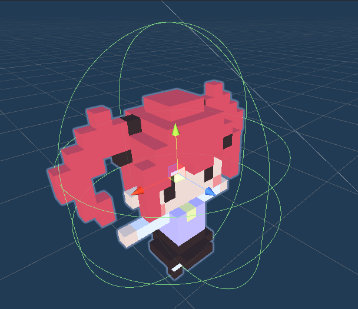

还需要添加：
- 碰撞器：使用 Capsule Collider 组件进行实现，参数如下图：
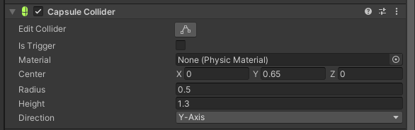
- 动画效果：模型自带了部分动画，因此对其进行条件组合之后如下图：
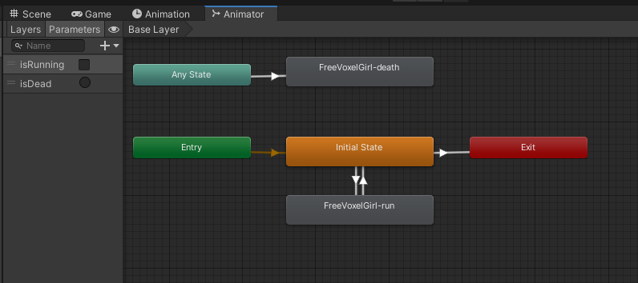

上图中， Player 存在两种状态参数和三种动画效果：
- 状态参数
  - `isRunning` 奔跑状态
  - `isDead` 在触碰敌人后变为该状态，并且持续
- 动画效果
  - 空闲：什么操作都没有的时候
  - 奔跑
  - 死亡：当 `isDead` 被触发时，播放死亡动画

### Solider

模型如下：

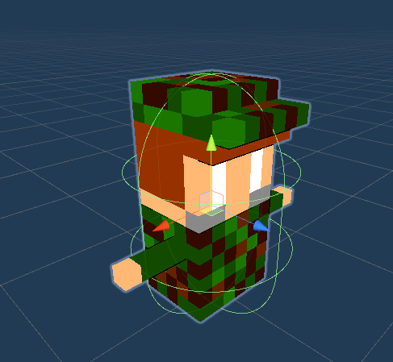

仍需添加：
- 碰撞器：使用 Capsule Collider 组件进行实现，参数如下图：
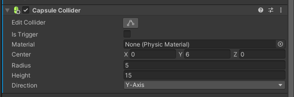
- 动画效果如下图：
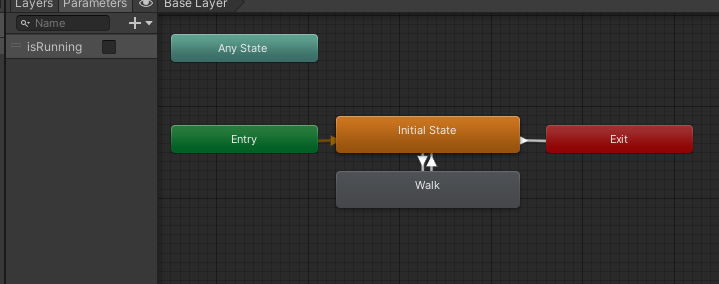

Soldier 有一种状态参数和两种动画效果：
- 状态参数：
  - `isRunning` 奔跑状态
- 动画效果：
  - 空闲
  - 走路（最好比 Player 要慢，不然会比较难让玩家获得成就感）

### 其他模型

除了人物之外，还存在如下模型：
- 地图平面
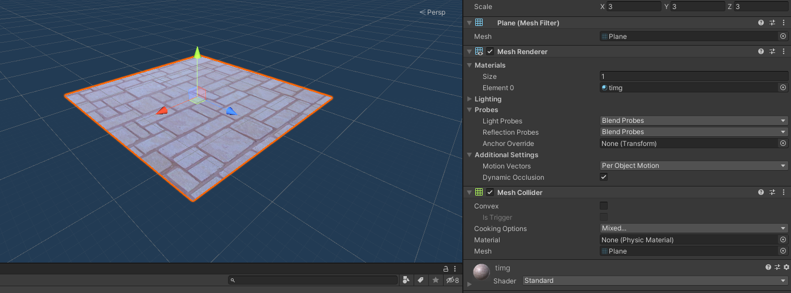
- 围栏
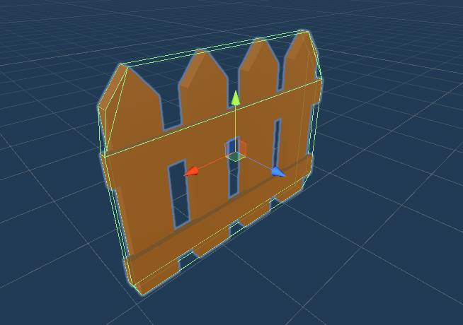

以及
- 区域碰撞器
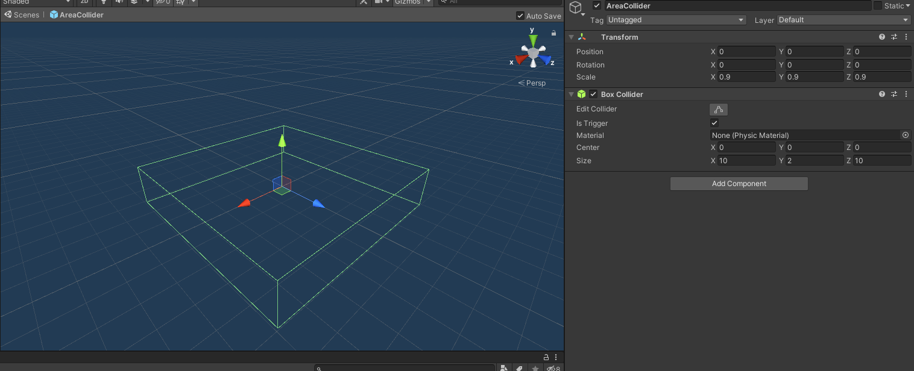

## 代码编写

本次设计依然使用了 *MVC* 架构，具体结构如下图：

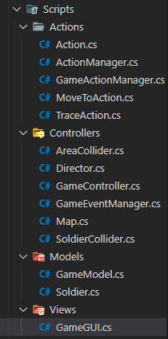

主要功能/特性如下

### 地图

#### 地图生成

> 该功能通过代码使用预制对象生成，具体实现为 Map 类

Map 类中，有：
- 四个子对象：
  - `planePrefab` 地面预制对象
  - `fencePrefab` 围栏预制对象
  - `areaColliderPrefab` 区域碰撞器预制对象
  - `center` 每个区域的中心点
- 四个方法
  - `LoadPlane()` 生成地图平面
  - `LoadBoundaries()` 生成外部围栏（地图边界）
  - `LoadFences()` 生成内部围栏
  - `LoadAreaColliders()` 生成区域碰撞器

具体代码如下（部分代码太长，有删减）：
```csharp
using UnityEngine;

namespace Patrol
{
  class Map : Object
  {
    private static GameObject planePrefab = Resources.Load<GameObject>("Prefabs/Plane"); // 地面
    private static GameObject fencePrefab = Resources.Load<GameObject>("Prefabs/Fence"); // 围栏
    private static GameObject areaColliderPrefab = Resources.Load<GameObject>("Prefabs/AreaCollider"); // 区域碰撞器
    public static Vector3[] center = new Vector3[] {
      new Vector3(-10, 0, -10), new Vector3(0, 0, -10), new Vector3(10, 0, -10),
      new Vector3(-10, 0, 0), new Vector3(0, 0, 0), new Vector3(10, 0, 0),
      new Vector3(-10, 0, 10), new Vector3(0, 0, 10), new Vector3(10, 0, 10)
    }; // 区域中心点

    // 生成地图平面
    public static void LoadPlane()
    {
      GameObject map = Instantiate(planePrefab);
    }

    // 生成外部围栏（地图边界）
    public static void LoadBoundaries()
    {
      ......
    }

    // 生成内部围栏
    public static void LoadFences()
    {
      ......
    }

    // 生成区域碰撞器
    public static void LoadAreaColliders()
    {
      ......
    }
  }
}
```

> 为了方便探测玩家所在的区域，每个区域碰撞器在生成时需要添加标识符，具体操作如下（`LoadAreaColliders` 方法）：
```csharp
// 生成区域碰撞器
public static void LoadAreaColliders()
{
  for (int i = 0; i < 9; ++i)
  {
    GameObject collider = Instantiate(areaColliderPrefab);  //实例化
    collider.name = "AreaCollider" + i;                     // 位置名字
    collider.transform.position = center[i];                // 设置位置
    collider.AddComponent<AreaCollider>().area = i;         // 设置区域号
  }
}
```

生成的地图如下：

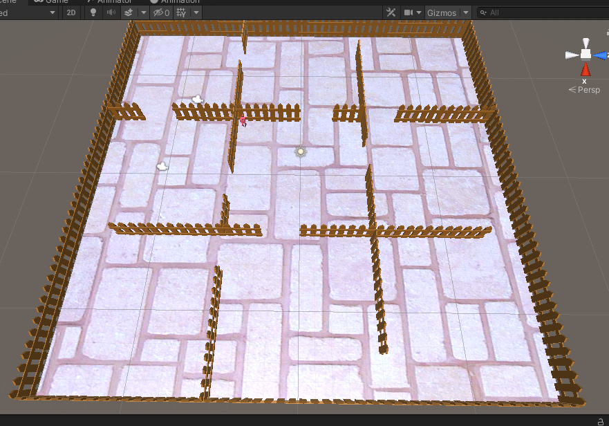

#### 区域检测

##### 区域检测脚本

> 在 Map 类加载区域碰撞器的过程中，给每个碰撞器添加了标识符，同时添加了检测脚本—— `AreaCollider` ，关于检测脚本，具体代码如下：

```csharp
using UnityEngine;

namespace Patrol
{
  public class AreaCollider : MonoBehaviour
  {
    public int area; // 当前区域 id

    public void OnTriggerEnter(Collider collider)
    {
      // 当玩家进入新区域时
      if (collider.gameObject.tag == "Player")
      {
        GameEventManager.GetInstance().PlayerEnterArea(area);
      }
    }
  }
}
```

> 使用 `OnTriggerEnter` 钩子函数更新玩家当前所在区域号，并且需要在区域碰撞器预制对象上设置 `is Trigger` 属性，如下图：

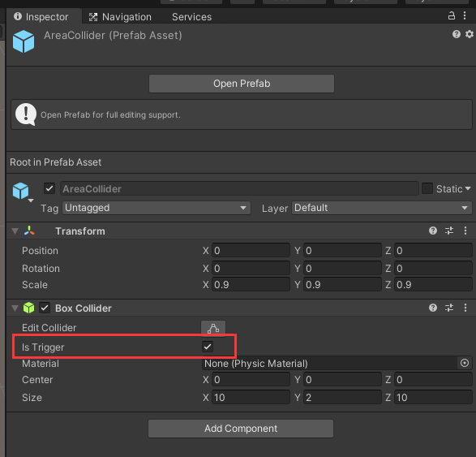

##### 进入区域事件

为了满足**订阅发布模式**的要求，在 `GameController` 中实现了 `OnPlayerEnterArea` 方法，用于订阅相关事件，并且在玩家进入新区域时， 触发`OnTriggerEnter`  并调用，具体代码如下：

```csharp
// 玩家进入新区域（同时摆脱一个巡逻兵，增加一个追捕的巡逻兵）
private void OnPlayerEnterArea(int area)
{
  // 非游戏状态
  if (model.state != GameState.RUNNING)
  {
    return;
  }

  if (currentArea != area)
  {
    // 更新分数
    model.AddScore(1);

    // 设置追随玩家的巡逻兵
    soldiers[currentArea].GetComponent<Soldier>().isFollowing = false; // 上一块区域的巡逻兵不追随
    currentArea = area; // 更新区域
    soldiers[currentArea].GetComponent<Soldier>().isFollowing = true; // 这一块区域的巡逻兵跟随
    actionManager.Trace(soldiers[currentArea], player); // 进行追捕

    // 如果分数达到目标要求
    if (model.score == model.targetScore)
    {
      view.state = model.state = GameState.WIN; // 游戏状态为胜利

      // 设置 player
      player.GetComponent<Animator>().Play("Initial State");
      player.GetComponent<Animator>().SetBool("isRunning", false);

      // 设置巡逻兵
      soldiers[currentArea].GetComponent<Soldier>().isFollowing = false;
      actionManager.Stop();
      for (int i = 0; i < 9; ++i)
      {
        soldiers[i].GetComponent<Animator>().SetBool("isRunning", false);
      }
    }
  }
}
```

### 巡逻兵相关

在 Model 中，定义了 `Soldier` 类，具体代码如下：
```csharp
using UnityEngine;

namespace Patrol
{
  public class Soldier : MonoBehaviour
  {
    public int area; // 所处的区域号
    public bool isFollowing = false; // 是否正在跟随

    void Awake()
    {
      gameObject.GetComponent<Rigidbody>().freezeRotation = true;
    }

    void Update()
    {
      // 抑制碰撞造成的旋转
      if (this.gameObject.transform.localEulerAngles.x != 0 || gameObject.transform.localEulerAngles.z != 0)
      {
        gameObject.transform.localEulerAngles = new Vector3(0, gameObject.transform.localEulerAngles.y, 0);
      }
      if (gameObject.transform.position.y != 0)
      {
        gameObject.transform.position = new Vector3(gameObject.transform.position.x, 0, gameObject.transform.position.z);
      }
    }
  }
}
```

#### 碰撞检测

##### 碰撞检测脚本

在 `GameController` 中，生成巡逻兵实例的具体代码如下：
```csharp
// 构造巡逻兵
private void LoadSoldiers()
{
  GameObject soldierPrefab = Resources.Load<GameObject>("Prefabs/Soldier");
  for (int i = 0; i < 9; ++i)
  {
    GameObject soldier = Instantiate(soldierPrefab);
    soldier.AddComponent<Soldier>().area = i;
    soldier.GetComponent<Rigidbody>().freezeRotation = true;
    // 添加碰撞检测脚本
    soldier.AddComponent<SoldierCollider>();
    soldier.name = "Soldier" + i;
    soldier.transform.position = Map.center[i];
    soldiers.Add(soldier);
  }
}
```

可以发现，在生成每一个实例的时候，都添加了 `SoldierConllider` 碰撞检测脚本，用于判断是否和玩家碰撞，该脚本具体代码如下：
```csharp
using UnityEngine;

namespace Patrol
{
  public class SoldierCollider : MonoBehaviour
  {
    public void OnCollisionEnter(Collision collision)
    {
      // 当巡逻兵与玩家碰撞时。
      if (collision.gameObject.tag == "Player")
      {
        GameEventManager.GetInstance().SoldierCollideWithPlayer();
      }
    }
  }
}
```

##### 玩家和巡逻兵碰撞事件

同[进入区域事件](#进入区域事件)类似，为了实现订阅发布模式，在 `GameController` 中实现了 `OnSoldierCollideWithPlayer` 方法，同时通过 `GameEventManager` 类实现解耦相关机制的处理。

`OnSoldierCollideWithPlayer` 代码如下：
```csharp
// 当巡逻兵与玩家碰撞时
private void OnSoldierCollideWithPlayer()
{
  // 游戏失败
  view.state = model.state = GameState.LOSE;

  // 设置玩家死亡动画
  player.GetComponent<Animator>().SetTrigger("isDead");
  player.GetComponent<Rigidbody>().isKinematic = true;

  // 取消追捕状态
  soldiers[currentArea].GetComponent<Soldier>().isFollowing = false;

  // 取消所有巡逻兵的动画
  actionManager.Stop();
  for (int i = 0; i < 9; ++i)
  {
    soldiers[i].GetComponent<Animator>().SetBool("isRunning", false);
  }
}
```

`GameEventManager` 类代码如下：
```csharp
namespace Patrol
{
  public class GameEventManager
  {
    private static GameEventManager instance; // 单例
    public delegate void OnPlayerEnterArea(int area);
    public static event OnPlayerEnterArea onPlayerEnterArea;

    public delegate void OnSoldierCollideWithPlayer();
    public static event OnSoldierCollideWithPlayer onSoldierCollideWithPlayer;

    // 获取实例
    public static GameEventManager GetInstance()
    {
      return instance ?? (instance = new GameEventManager());
    }

    // 玩家进入区域
    public void PlayerEnterArea(int area)
    {
      onPlayerEnterArea?.Invoke(area);
    }

    // 巡逻兵碰到玩家
    public void SoldierCollideWithPlayer()
    {
      onSoldierCollideWithPlayer?.Invoke();
    }
  }
}
```

> `GameEventManager` 类还和上面的玩家进入新区域的区域检测订阅有关，提供了**玩家进入区域**、**巡逻兵与玩家碰撞**事件的钩子函数

除此之外，还需要在 `GameController` 的 `Awake` 方法中添加注册相关的事件处理函数，具体代码如下：
```csharp
void Awake()
{
  model.onRefresh += delegate
  {
    view.state = model.state;
    view.score = model.score;
  };

  view = gameObject.AddComponent<GameGUI>();
  actionManager = gameObject.AddComponent<GameActionManager>();

  // 设置游戏事件及其处理函数
  GameEventManager.onPlayerEnterArea += OnPlayerEnterArea;
  GameEventManager.onSoldierCollideWithPlayer += OnSoldierCollideWithPlayer;

  Director.GetInstance().OnSceneWake(this);
}
```

#### 相关动作

巡逻兵的相关动作，都使用 `GameActionManager` 来进行实现，具体代码如下：
```csharp
using System.Collections.Generic;
using UnityEngine;

namespace Patrol
{
  public class GameActionManager : ActionManager, IActionCallback
  {
    private int currentArea = -1; // 最近区域
    Dictionary<int, MoveToAction> moveToActions = new Dictionary<int, MoveToAction>(); // 自主巡逻动作

    // 巡逻兵追随玩家
    public void Trace(GameObject patrol, GameObject player)
    {
      ......
    }

    // 巡逻兵自主巡逻
    public void GoAround(GameObject patrol)
    {
      ......
    }

    // 停止所有动画
    public void Stop()
    {
      ......
    }

    // 动作完成
    public new void ActionDone(Action action)
    {
      ......
    }

    // 计算下一巡逻目的地
    private Vector3 GetGoAroundTarget(GameObject patrol)
    {
      ......
    }
  }
}
```

##### 自主巡逻

和自主巡逻相关的有两个方法，分别是 `GoAround` 和 `GetGoAroundTarget` ，前者是用于执行动作，后者是获取下一个巡逻目的地，具体代码如下：
```csharp
// 巡逻兵自主巡逻
public void GoAround(GameObject patrol)
{
  var area = patrol.GetComponent<Soldier>().area;
  // 防止重入
  if (moveToActions.ContainsKey(area))
  {
    return;
  }
  // 计算下一巡逻目的地
  var target = GetGoAroundTarget(patrol);
  MoveToAction action = MoveToAction.GetAction(patrol, this, target, 1.5f, area);
  moveToActions.Add(area, action);
  AddAction(action);
}

// 计算下一巡逻目的地
private Vector3 GetGoAroundTarget(GameObject patrol)
{
  Vector3 pos = patrol.transform.position;
  var area = patrol.GetComponent<Soldier>().area;

  // 计算当前区域的边界
  float x_down = -15 + (area % 3) * 10;
  float x_up = x_down + 10;
  float z_down = -15 + (area / 3) * 10;
  float z_up = z_down + 10;

  // 随机生成下一个目标点
  var move = new Vector3(Random.Range(-9, 9), 0, Random.Range(-9, 9));
  var next = pos + move;
  int tryCount = 0;

  // 边界判断
  while (next.x > (x_up - 1) ||
        next.x < (x_down + 1) ||
        next.z > (z_up - 1) ||
        next.z < (z_down + 1) ||
        next == pos)
  {
    move = new Vector3(Random.Range(-3, 3), 0, Random.Range(-3, 3));
    next = pos + move;

    // 当无法获取到符合要求的 target 时，抛出异常
    if ((++tryCount) > 50)
    {
      Debug.LogFormat("point {0}, area({1}, {2}, {3}, {4}, {5})", pos, area, x_down, x_up, z_down, z_up);
      throw new System.Exception("Too many loops for finding a target");
    }
  }
  return next;
}
```

效果如下图：

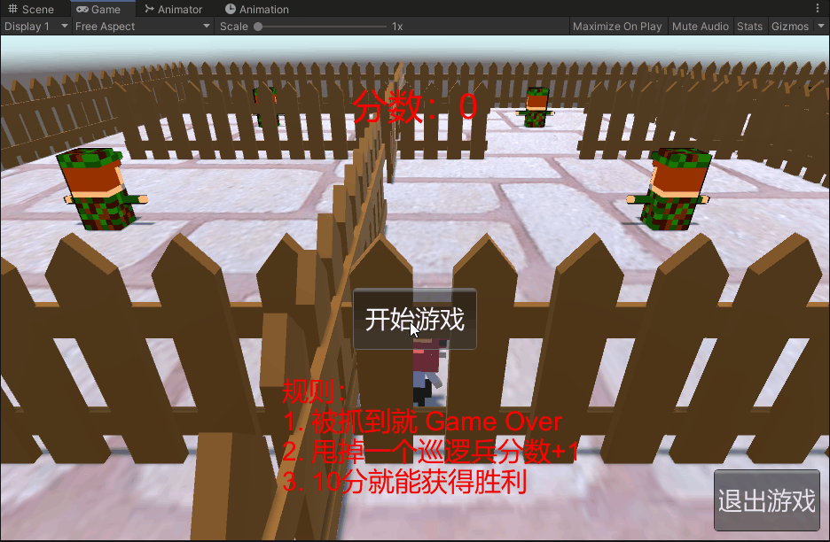

##### 追捕玩家

在 `TraceAcion` 类中实现了追捕玩家的具体动作，代码如下：
```csharp
using UnityEngine;

namespace Patrol
{
  public class TraceAction : Action
  {
    public GameObject target; // 目标
    public float speed; // 速度

    public static TraceAction GetAction(GameObject gameObject, IActionCallback callback, GameObject target, float speed)
    {
      TraceAction action = CreateInstance<TraceAction>();
      action.gameObject = gameObject;
      action.transform = gameObject.transform;
      action.callback = callback;
      action.target = target;
      action.speed = speed;
      return action;
    }

    public override void Start() { }

    public override void Update()
    {
      gameObject.transform.position = Vector3.MoveTowards(gameObject.transform.position, target.transform.position, 1.5f * speed * Time.deltaTime);

      // 如果没有追捕状态
      if (gameObject.GetComponent<Soldier>().isFollowing == false || (gameObject.transform.position - target.transform.position).sqrMagnitude < 0.00001f)
      {
        destroy = true;
        callback.ActionDone(this);
      }
      else // 需要根据玩家位置不断追捕
      {
        Quaternion rotation = Quaternion.LookRotation(target.transform.position - gameObject.transform.position, Vector3.up);
        gameObject.transform.rotation = rotation;
      }
    }
  }
}
```

## 使用方法和效果展示

### 使用方法

使用方法一：
1. 点击下载[default 压缩包（4.62MB）](https://github.91chifun.workers.dev//https://github.com/FFFengMJL/unity-learning/releases/download/0.0.7/default.zip)
2. 在 unity 中新建一个空白项目
3. 解压压缩包，打开 `智能巡逻兵` 文件夹，
4. 将 `Assets` 文件夹替换掉原本项目中的 Assets 文件夹
5. 打开 Assets 文件夹，将 Scenes 文件夹中的 **智能巡逻兵** 拖入场景中
6. 删除原本的场景
7. 点击运行便可以使用

使用方法二：
1. 点击下载[可执行文件压缩包](https://github.91chifun.workers.dev//https://github.com/FFFengMJL/unity-learning/releases/download/0.0.7/exe.zip)
2. 解压到一个空文件夹中
3. 双击 .exe 文件便可直接运行

### 效果展示

失败：

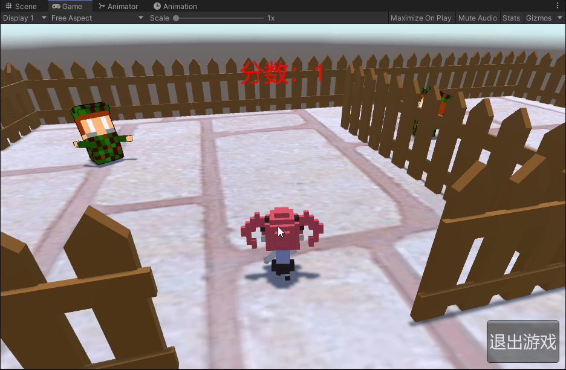

再来一局：


胜利：

