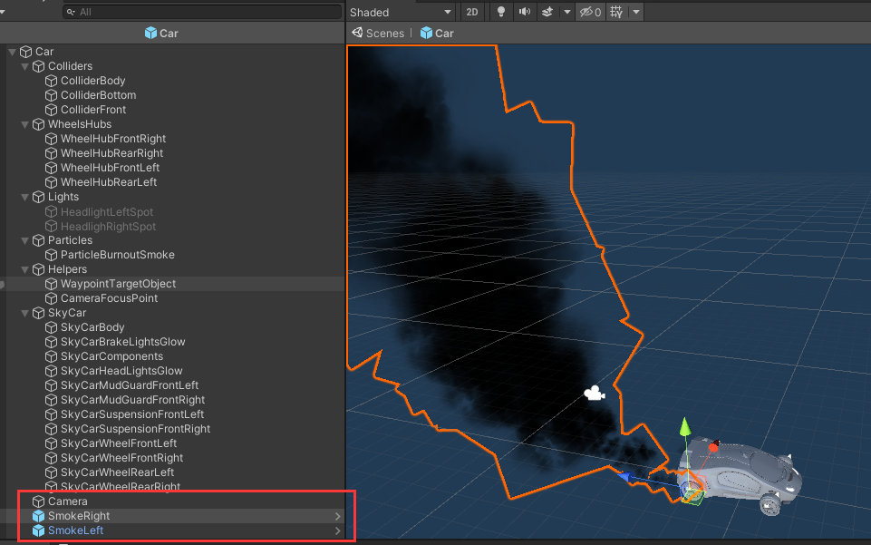
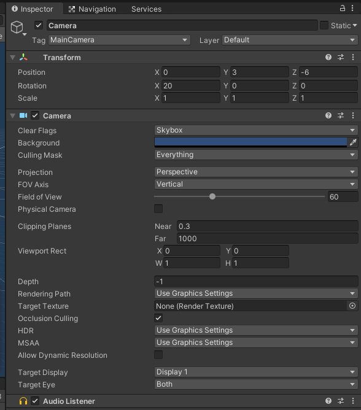
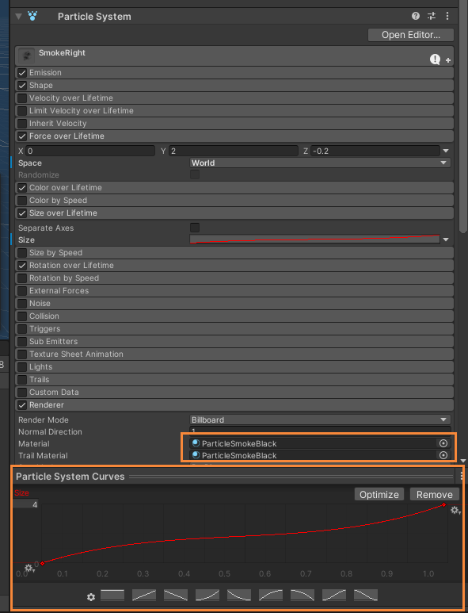
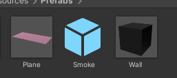
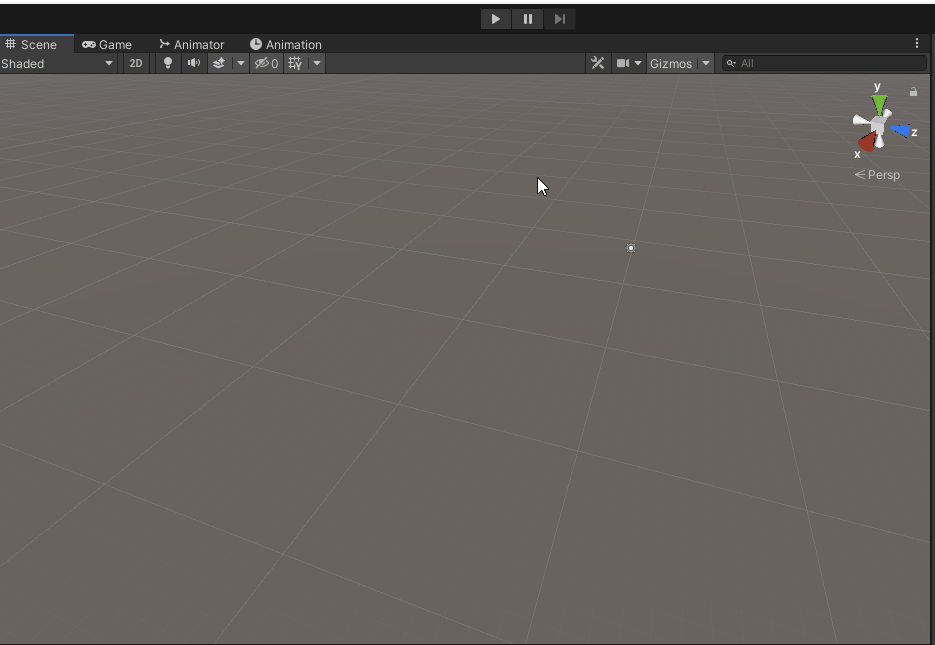

# 粒子系统与流动效果

- [粒子系统与流动效果](#粒子系统与流动效果)
  - [作业要求](#作业要求)
  - [模拟汽车尾气](#模拟汽车尾气)
    - [设置车辆模型相关](#设置车辆模型相关)
      - [添加 camera](#添加-camera)
      - [设置粒子效果](#设置粒子效果)
    - [加载资源](#加载资源)
    - [碰撞检测](#碰撞检测)
    - [损坏程度和粒子的设置](#损坏程度和粒子的设置)
    - [其他辅助功能](#其他辅助功能)
    - [效果演示和使用方法](#效果演示和使用方法)
      - [效果展示](#效果展示)
      - [使用方法](#使用方法)

## 作业要求

> 本次作业基本要求是三选一

1. 简单粒子制作
   - 按参考资源要求，制作一个粒子系统，参考资源
   - 使用 3.3 节介绍，用代码控制使之在不同场景下效果不一样
2. 完善官方的“汽车尾气”模拟
   - 使用官方资源资源 Vehicle 的 car， 使用 Smoke 粒子系统模拟启动发动、运行、故障等场景效果
3. 参考 http://i-remember.fr/en 这类网站，使用粒子流编程控制制作一些效果， 如“粒子光环”
   - 可参考以前作业

## 模拟汽车尾气

### 设置车辆模型相关

> 本次使用了 [Standard Assets](https://assetstore.unity.com/packages/essentials/asset-packs/standard-assets-for-unity-2018-4-32351) 资源包

需要导入 Standard Assets 资源包下的：
- `CrossPlatformInput` ：用于输入
- `ParticleSystems` ：粒子系统
- `Utility` : 脚本相关
- `Vehicles` : 需要用到其中的 `Car` 路径中的汽车模型和对应的音效等

在该模型中，需要进行如下操作：
- 添加一个 camera ，用于汽车运动时的视角显示
- 设置左右排气管的粒子系统

如下图：



#### 添加 camera

汽车模型的的 camera 相关设置如下图：



#### 设置粒子效果

复制 car 模型自带的 `ParticleBurnoutSmoke` 为 `SmokeRight` 和 `SmokeLeft` ，分别作为两侧的围棋系统。

分别修改这两个粒子系统，设置相关的参数，如下图：



> 默认尾气的材质为 `ParticleSmokeWhite` ，需要修改为 `ParticleSmokeBlack` ，否则难以模拟出尾气的效果

尾气粒子效果如下：


### 加载资源

汽车模型需要运动来反映尾气效果，因此需要构建场地来让汽车跑动，构建如下预制对象，用于生成场地：



相关代码：

```csharp
// 装载地图资源。
private void LoadResources()
{
  // 加载地图
  var plane = Instantiate(Resources.Load<GameObject>("Prefabs/Plane"));
  plane.name = "Plane";

  // 加载车辆资源
  car = Instantiate(Resources.Load<GameObject>("Prefabs/Car"));
  car.name = "Car";

  // 加载边界
  var wallPrefab = Resources.Load<GameObject>("Prefabs/Wall");
  // 四个方向设置边界
  {
    GameObject wall = Instantiate(wallPrefab);
    wall.transform.position = new Vector3(-25, 2, 0);
    wall.transform.localScale = new Vector3(1, 4, 100);
  }
  {
    GameObject wall = Instantiate(wallPrefab);
    wall.transform.position = new Vector3(25, 2, 0);
    wall.transform.localScale = new Vector3(1, 4, 100);
  }
  {
    GameObject wall = Instantiate(wallPrefab);
    wall.transform.position = new Vector3(0, 2, 50);
    wall.transform.localScale = new Vector3(50, 4, 1);
  }
  {
    GameObject wall = Instantiate(wallPrefab);
    wall.transform.position = new Vector3(0, 2, -50);
    wall.transform.localScale = new Vector3(50, 4, 1);
  }
}
```

### 碰撞检测

为了根据汽车的损伤程度进行故障模拟，需要添加：
- 记录和更新车辆的损坏程度
- 根据损坏程度设置粒子相关参数

对 car 模型的损坏程度的记录和更新通过 `CarCollider.cs` 脚本完成，具体代码如下：
```csharp
using UnityEngine;

namespace Smoke
{
  public class CarCollider : MonoBehaviour
  {
    private float damage = 0; // 损坏情况

    // 获取损坏情况
    public float GetDamage()
    {
      return this.damage;
    }

    // 设置损坏情况
    public void SetDamage(float d)
    {
      this.damage = d;
    }

    // 碰撞时，增加其损坏程度
    private void OnCollisionEnter(Collision collision)
    {
      damage += 4.5f * gameObject.GetComponent<Rigidbody>().velocity.magnitude; // 根据汽车速度增加损伤程度
    }
  }
}
```

### 损坏程度和粒子的设置

粒子的相关显示，分别有：
- 颜色深浅：与汽车损坏程度正相关
- 运动速度：和汽车引擎的转速成正相关

这两个属性的设置都在 `SmokeParticle.cs` 中解决，具体函数分别如下：
```csharp
// 设置粒子释放速率
private void SetEmissionRate()
{
  var K = 5000; // 比例系数
  var emission = exhaust.emission; // 需要获取成变量，不然无法修改
  emission.rateOverTime = K * carController.Revs; // 需要汽车引擎转速
}

// 设置粒子颜色
private void SetColor()
{
  var color = exhaust.colorOverLifetime; // 获取粒子颜色
  var damage = car.GetComponent<CarCollider>().GetDamage(); // 获取车辆损坏情况。

  // 设置粒子颜色，损坏越严重，颜色越深
  var gradient = new Gradient();
  var colorKeys = new GradientColorKey[] { new GradientColorKey(Color.white, 0.0f), new GradientColorKey(new Color(214, 189, 151), 0.079f), new GradientColorKey(Color.white, 1.0f) };
  var alphaKeys = new GradientAlphaKey[] { new GradientAlphaKey(0.0f, 0.0f), new GradientAlphaKey(damage / 255f + 10f / 255f, 0.061f), new GradientAlphaKey(0.0f, 1.0f) };
  gradient.SetKeys(colorKeys, alphaKeys);
  color.color = gradient;
}
```

### 其他辅助功能

为了便于直观反映和调整汽车损伤状况，在 `MainController.cs` 中添加了如下 GUI 用于便捷显示，和调整损伤状况：
```csharp
// GUI
void OnGUI()
{
  var labelStyle = new GUIStyle() { fontSize = 40 };
  var buttonStyle = new GUIStyle("button")
  {
    fontSize = 30,
    alignment = TextAnchor.MiddleRight
  };

  // 损坏程度
  var carDamage = string.Format("损伤情况：{0:#0.00}",
    car.GetComponent<CarCollider>().GetDamage() / 2);
  GUI.Label(new Rect(160, 80, 200, 100), carDamage, labelStyle);

  // 出力情况
  var carRevs = string.Format("引擎出力：{0:#0.00}",
    car.GetComponent<CarController>().Revs);
  GUI.Label(new Rect(160, 30, 200, 100), carRevs, labelStyle);

  // 设置为 0 损坏
  if (GUI.Button(new Rect(160, 130, 100, 50), "0%", buttonStyle))
  {
    car.GetComponent<CarCollider>().SetDamage(0);
  }

  // 设置为 50% 损坏
  if (GUI.Button(new Rect(160, 180, 100, 50), "50%", buttonStyle))
  {
    car.GetComponent<CarCollider>().SetDamage(100);
  }

  // 设置为 100% 损坏
  if (GUI.Button(new Rect(160, 230, 100, 50), "100%", buttonStyle))
  {
    car.GetComponent<CarCollider>().SetDamage(200);
  }
}
```

### 效果演示和使用方法

#### 效果展示

> gif 比较大，如果实在加载不出来，可以前往[视频演示](https://www.bilibili.com/video/BV1vD4y1X7b7/)查看效果

静止状态：



0% 损伤运行：


50% 损伤运行：


100% 损伤运行


碰撞：


#### 使用方法

使用方法：
1. 点击下载[car.zip 压缩包（10.04MB）](https://github.91chifun.workers.dev//https://github.com/FFFengMJL/unity-learning/releases/download/0.0.8/car.zip)
2. 在 unity 中新建一个空白项目
3. 解压压缩包，打开 `car` 文件夹，
4. 将 `Assets` 文件夹替换掉原本项目中的 Assets 文件夹
5. 打开 Assets 文件夹，将 Scenes 文件夹中的 **car** 拖入场景中
6. 删除原本的场景
7. 点击运行便可以使用

相关操作为：
- `W`：引擎向前发力
- `S`：引擎向后发力
- `A`：汽车往左转
- `D`：汽车向右转