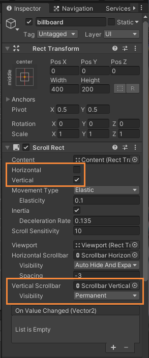
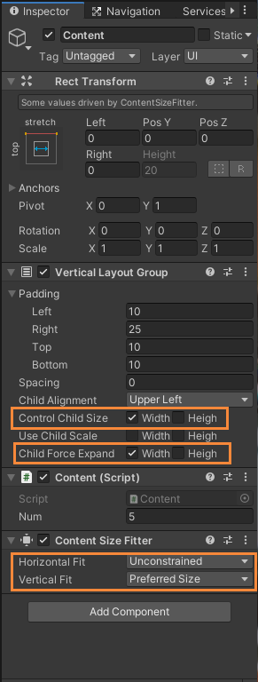
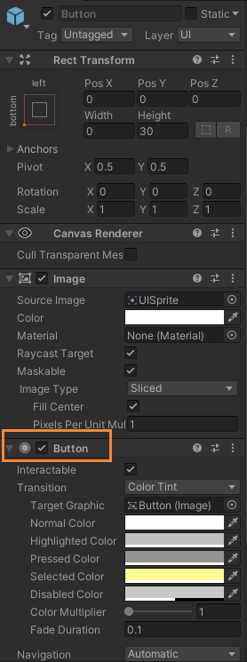
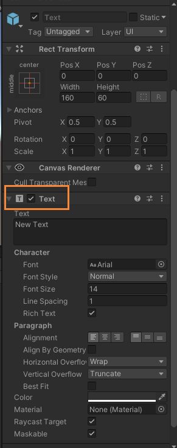
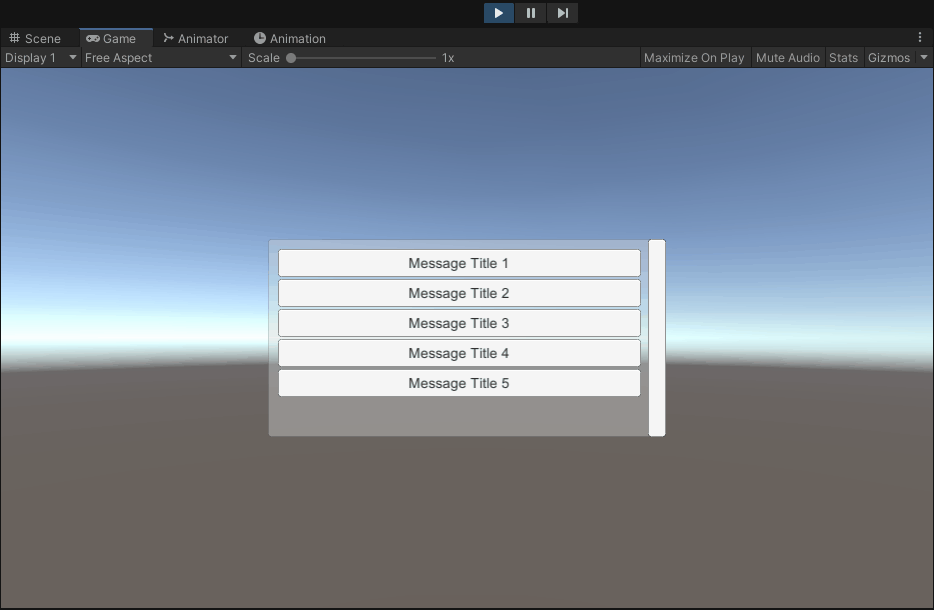
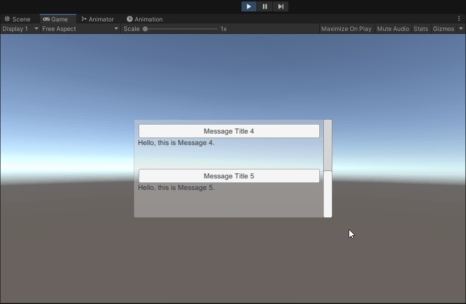

# UI 系统

- [UI 系统](#ui-系统)
  - [作业要求](#作业要求)
  - [公告板](#公告板)
    - [Scroll View](#scroll-view)
    - [创建预制对象（标题和消息）](#创建预制对象标题和消息)
    - [加载资源（初始化）](#加载资源初始化)
    - [列表展开和关闭](#列表展开和关闭)
      - [动画效果](#动画效果)
    - [效果](#效果)
    - [使用方法](#使用方法)

## 作业要求

以下作业五选一：

1. 血条（Health Bar）的预制设计。具体要求如下
   - 分别使用 IMGUI 和 UGUI 实现
   - 使用 UGUI，血条是游戏对象的一个子元素，任何时候需要面对主摄像机
   - 分析两种实现的优缺点
   - 给出预制的使用方法
2. UI 效果制作（你仅需要实现以下效果之一）
   - 进入 NGUI 官方网站，使用 UGUI 实现以下效果
     - Inventory 背包系统
     - Quest Log 公告牌
     - Scroll View 选择板
   - 以上例子需要使用 Unity web player， 仅支持以下操作系统与浏览器，参见官方下载
     - Windows 版 IE11
     - Mac OS X 10.7 Safari
     - 出现界面需要等待较长时间，打开页面让它慢慢加载
3. DOTween 仿写
   - 如果你觉得 UI 不是你的菜，喜欢复杂的设计与代码
   - 研究 DOTween 网站 http://dotween.demigiant.com/getstarted.php 网页， 它在 Specific settings 中 transform.DoMove 返回 Tween 对象。请实现该对象，实现对动作的持续管理。
   - 本作业有较大难度，务必参考师兄的作业
4. 编写一个组件，提供常用窗口服务
   - 修改 Game Jam Menu Template 的脚本
     - 如 ShowPanels 脚本
   - 具体要求是实现一个方法
     - 支持某个面板窗口独立显示
     - 支持某个面板窗口模态，其他面板窗口显示在后面
     - 支持几个窗口同时显示，仅一个窗口是活动窗口
5. 如果你喜欢凭空构思场景，请自制有趣的 UI 场景
   - 例如：“几个小动物（3D）开会，语句从每个动物头上飘出，当达到一个大小，会出现清晰的文字！如果文字较多，会自动滚动”

## 公告板

### Scroll View

1. 在新建的 Canvas 对象中新建 ScroolView 对象，并修改对应的 inspector 属性：
   - 取消滚动视图的水平滚动
   - 设置竖直滚动条一直可见

修改如下图：



2. 修改名为 billboard 的 Scrool View 对象中子对象 Viewport 中的子对象 Content 的相关设置，因为其存放着列表内容：
   - 添加 `Verticle Layout Group` 组件，用于构建**垂直列表视图**
     - 设置 `Child Controls Size` 和 `Child Force Expand` 属性，用于自动布局
   - 添加 `Content Size Fitter` 组件，用于实现**列表高度自适应**效果

修改如下图：



### 创建预制对象（标题和消息）

为了满足效果，使用 Button 和 Text 分别用于构建标题和消息，具体设置如下：





### 加载资源（初始化）

初始化使用如下代码（Content.cs）进行实现，并将其绑定到 Content 子对象上：

```csharp
using UnityEngine;
using UnityEngine.UI;

public class Content : MonoBehaviour
{
  public int num = 6; // 预定义消息总数
  private RectTransform content; // 列表布局

  void Start()
  {
    content = GetComponent<RectTransform>();

    // 加载列表资源
    LoadResources();
  }

  // 加载列表资源
  void LoadResources()
  {
    for (int i = 0; i < num; ++i)
    {
      // 设置消息标题
      Button title = Instantiate(Resources.Load<Button>("Prefabs/Button")); // 加载预制对象
      title.name = "Message Title " + (i + 1); // 设置对象名称
      title.GetComponentInChildren<Text>().text = "Message Title " + (i + 1); // 设置标题文本内容

      // 添加 Button 至消息列表
      title.transform.SetParent(transform, false);

      // 设置消息文本
      Text body = Instantiate(Resources.Load<Text>("Prefabs/Text")); // 加载预制对象
      body.name = "Message Body " + (i + 1); // 设置对象名称
      body.text = "Hello, this is Message " + (i + 1) + "."; // 设置消息文本内容

      // 添加 Text 至消息列表
      body.transform.SetParent(transform, false);
      body.gameObject.SetActive(false);

      // 设置 Button 响应点击事件
      ButtonHandler handler = title.gameObject.AddComponent<ButtonHandler>();
      handler.text = body;
    }
  }
}
```

### 列表展开和关闭

> 在上一个代码块中，可以看到一个新的类 ButtonHandler ，用于处理标题（按钮）的事件响应。

在 ButtonHandler.cs 文件中，使用如下代码处理点击事件：

```csharp
using System.Collections;
using UnityEngine;
using UnityEngine.UI;

public class ButtonHandler : MonoBehaviour
{
  public Text text; // 消息主体
  public int frame = 5; // 动画帧率
  private float textHeight; // 消息主体 Text 的高度
  private float textWidth; // 消息主体 Text 的宽度

  void Start()
  {
    GetComponent<Button>().onClick.AddListener(OnClick); // 绑定响应点击事件
    textHeight = text.rectTransform.sizeDelta.y; // 记录消息主体 Text 的高度
    textWidth = text.rectTransform.sizeDelta.x; // 记录消息主体 Text 的宽度
  }

  // 响应点击事件
  void OnClick()
  {

    if (text.gameObject.activeSelf) // 当消息主体已被展开，播放关闭动画
    {
      StartCoroutine("CloseText");
    }
    else // 当消息主体未被展开，播放展开动画
    {
      StartCoroutine("OpenText");
    }
  }

  // 列表关闭动画
  private IEnumerator CloseText()
  {
    ......
  }

  // 列表展开动画
  private IEnumerator OpenText()
  {
    ......
  }
}
```

#### 动画效果

在上面的代码中，可以看到两个为了实现展开和关闭的两个功能，分别使用了两个函数来完成对应的动画效果，代码如下：
```csharp
  // 列表关闭动画
  private IEnumerator CloseText()
  {
    // 设置旋转角度的初始值和旋转速度
    float angleX = 0;
    float angleSpeed = 90f / frame;
    // 设置 Text 初始高度和高度缩放速度
    float height = textHeight;
    float heightSpeed = textHeight / frame;

    // 执行动画
    for (int i = 0; i < frame; ++i)
    {
      angleX -= angleSpeed; // 更新旋转角度
      height -= heightSpeed; // 更新 Text 高度

      // 应用新的旋转角度和高度
      text.transform.rotation = Quaternion.Euler(angleX, 0, 0);
      text.rectTransform.sizeDelta = new Vector2(textWidth, height);

      // 结束动画
      if (i == frame - 1)
      {
        text.gameObject.SetActive(false);
      }
      yield return null;
    }
  }

  // 列表展开动画
  private IEnumerator OpenText()
  {
    // 设置旋转的初始值和旋转速度
    float angleX = -90f;
    float angleSpeed = 90f / frame;

    // 设置 Text 初始高度和高度缩放速度
    float height = 0;
    float heightSpeed = textHeight / frame;

    // 执行动画
    for (int i = 0; i < frame; ++i)
    {
      angleX += angleSpeed; // 更新旋转角度
      height += heightSpeed; // 更新 Text 高度

      // 应用新的旋转角度和高度
      text.transform.rotation = Quaternion.Euler(angleX, 0, 0);
      text.rectTransform.sizeDelta = new Vector2(textWidth, height);

      // 结束动画
      if (i == 0)
      {
        text.gameObject.SetActive(true);
      }
      yield return null;
    }
  }
```

在代码中，为了实现对应的动画效果，使用了协程，通过循环变换实现动画的帧绘制，从而更新对应的旋转角度和 Text 对象的高度。

### 效果

展开：



关闭：



### 使用方法

使用方法：
1. 点击下载[billboard.zip 压缩包（12.5KB）](https://github.91chifun.workers.dev//https://github.com/FFFengMJL/unity-learning/releases/download/0.0.9/billboard.zip)
2. 在 unity 中新建一个空白项目
3. 解压压缩包
4. 将 `Assets` 文件夹替换掉原本项目中的 Assets 文件夹
5. 打开 Assets 文件夹，将 Scenes 文件夹中的 **billboard** 拖入场景中
6. 删除原本的场景
7. 点击运行便可以使用