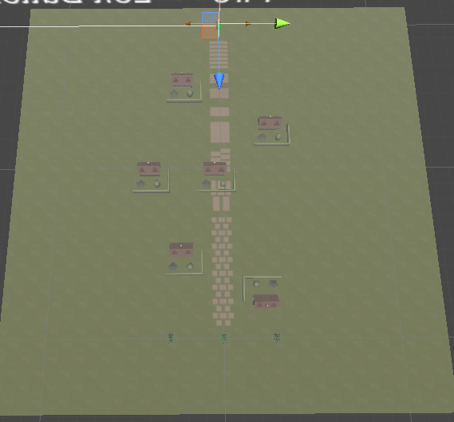
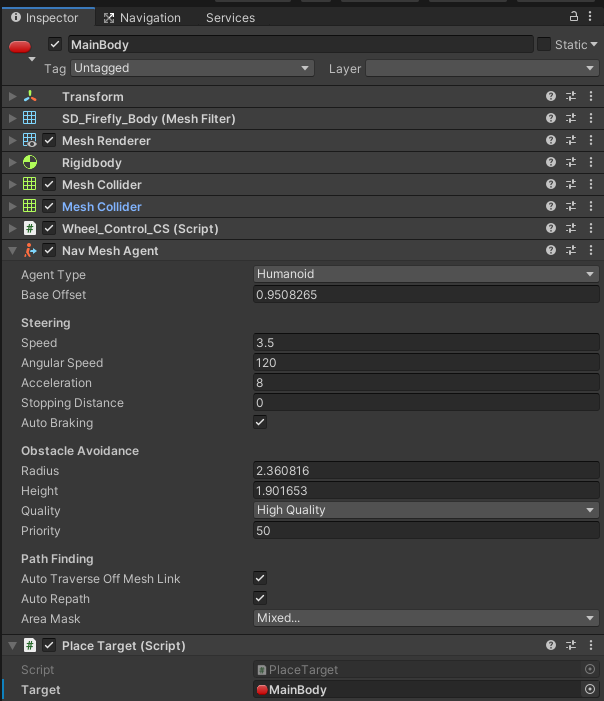
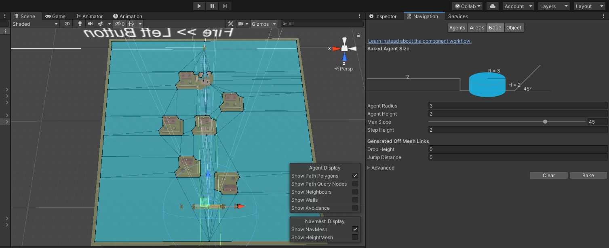
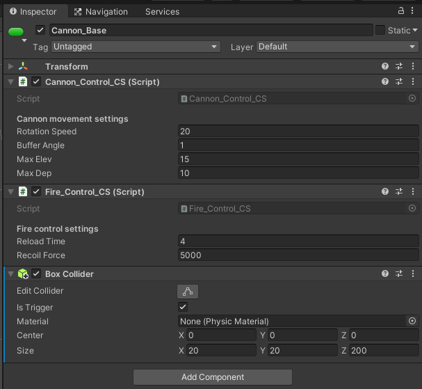
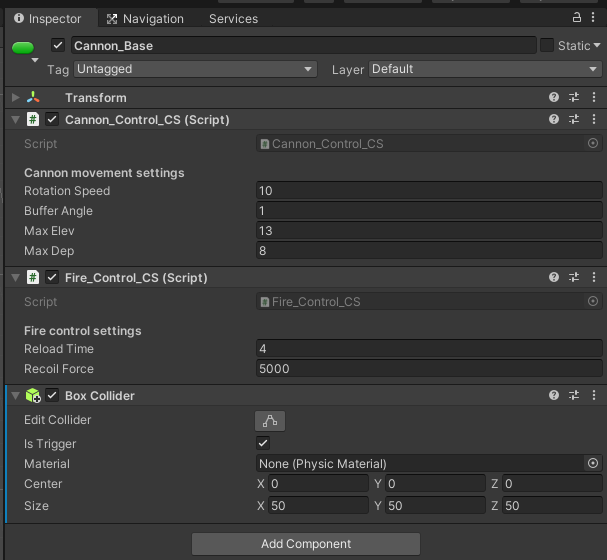

# 游戏智能

- [游戏智能](#游戏智能)
  - [作业要求](#作业要求)
  - [坦克 AI](#坦克-ai)
    - [场地搭建](#场地搭建)
    - [路径规划](#路径规划)
    - [智能攻击](#智能攻击)
    - [其他](#其他)
    - [AI 坦克消灭](#ai-坦克消灭)
    - [玩家 HP 显示常驻](#玩家-hp-显示常驻)
    - [效果展示和使用方法](#效果展示和使用方法)
      - [效果展示](#效果展示)
      - [使用方法](#使用方法)

## 作业要求

> 以下作业三选一

1. 有趣 AI 小游戏制作，不限于以下范围
   - 让事物具有学习功能，经过不同训练可以达到不同效果。如健身达人
   - 利用机器学习或人工智能算法实现学习的创新游戏场景片段
   - 利用在线语音识别或人脸识别等AI服务的创新游戏场景片段
2. 坦克对战游戏 AI 设计。从商店下载游戏：“Kawaii” Tank 或 其他坦克模型，构建 AI 对战坦克。具体要求
   - 使用“感知-思考-行为”模型，建模 AI 坦克
   - 场景中要放置一些障碍阻挡对手视线
   - 坦克需要放置一个矩阵包围盒触发器，以保证 AI 坦克能使用射线探测对手方位
   - AI 坦克必须在有目标条件下使用导航，并能绕过障碍。（失去目标时策略自己思考）
   - 实现人机对战

## 坦克 AI

导入 [Kawaii Tank](https://assetstore.unity.com/packages/3d/vehicles/land/kawaii-tanks-free-version-1-1-54604) 包，同时需要 standard Asset 中的交叉输入相关组件

### 场地搭建

以默认的 `Test_Field` 为基础，修改得到部分地图，得到地图如下：



### 路径规划

路径规划使用 unity 自带的 `Nav Mesh Agent` 来实现，因此：

1. 设置场地 `Terrain` 的 `Navigation` ，具体如下图：


2. 给每个敌对 AI 坦克的 `MainBody` 部件添加 `Nav Mesh Agent` 组件，用于进行自动寻路，具体如下：



3. 创建 `PlaceTarget` 脚本，用于定位目标，并将其添加到敌对 AI 坦克的 `MainBody` 上，脚本代码如下：

```csharp
using System.Collections;
using System.Collections.Generic;
using UnityEngine;
using UnityEngine.AI;

public class PlaceTarget : MonoBehaviour
{
  public GameObject target;  // 目标所在
  NavMeshAgent mr;   // 导航相关

  void Start()
  {
    mr = GetComponent<NavMeshAgent>(); // 获取自身的 NavMeshAgent 组件
  }

  // Update is called once per frame
  void Update()
  {
    mr.SetDestination(target.transform.position); // 更新目标位置
  }
}
```

4. 在 AI 坦克的 `Navigation` 处生成导航网格图，具体如下：



至此，AI 坦克便能够根据玩家坦克所在的位置来进行移动

### 智能攻击

使用碰撞器来实现 AI 坦克的攻击开关。

1. 给 AI 坦克模型和玩家坦克模型上的炮管 `Cannoo_Base` 组件都添加上**盒形碰撞器** ，并将玩家坦克的炮管的 tag 改为 `Player` 用于识别，如下图：

AI 坦克:



Player 坦克：



2. 修改 AI 坦克炮管 `Cannoo_Base` 组件上的 `Fire_Control_CS.cs` 脚本，使之在碰撞后可以开火，添加 `OnTriggerEnter` 方法并修改 `Update` 方法，具体如下：

```csharp
    void Update()
    {
      if (idScript.isPlayer)
      {
#if UNITY_ANDROID || UNITY_IPHONE
				Mobile_Input ();
#else
        Desktop_Input();
#endif
      }
      else
      {
        // 每三秒开火一次
        count = count + Time.deltaTime;
        if (count > 3.0f && canFire)
        {
          Fire();
          count = 0;
        }
      }
    }

    void OnTriggerEnter(Collider collider)
    {
      // 当识别到对方是玩家坦克时，打开开火开关
      if (collider.gameObject.tag == "Player")
      {
        targetPos = collider.gameObject.transform;
        canFire = true;
      }
    }
```

### 其他

### AI 坦克消灭

为了使 AI 坦克 HP 归零时消灭，对 `Start_Destroying` 方法进行简单的修改，如下：

```csharp
    void Start_Destroying()
    {
      if (!idScript.isPlayer)
      {
        this.gameObject.SetActive(false); // 设置为不可见
      }

      // Send message to all the parts.
      BroadcastMessage("Destroy", SendMessageOptions.DontRequireReceiver);
      // Create destroyedPrefab.
      if (destroyedPrefab)
      {
        GameObject tempObject = Instantiate(destroyedPrefab, bodyTransform.position, Quaternion.identity) as GameObject;
        tempObject.transform.parent = bodyTransform;
      }
      // Remove the Damage text.
      if (displayScript)
      {
        Destroy(displayScript.gameObject);
      }
      // Destroy this script.
      Destroy(this);
    }
```

### 玩家 HP 显示常驻

为了玩家体验，选择将玩家的 HP 值常驻显示，而 AI 坦克则是受到攻击后才显示，因此修改 `Damage_Control_CS.cs` 脚本中的 `Update` 方法，具体如下：

```csharp
    void Update()
    {
      if (idScript.isPlayer)
      {
        displayScript.Get_Damage(durability, initialDurability); // 玩家 HP 值常驻
      }
      // Destruct
      if (idScript.isPlayer)
      {
#if UNITY_ANDROID || UNITY_IPHONE
				if (CrossPlatformInputManager.GetButtonDown ("Destruct")) {
#else
        if (Input.GetKeyDown(KeyCode.Return))
        {
#endif
          Start_Destroying();
        }
      }
    }
```

### 效果展示和使用方法

#### 效果展示
<div style="position: relative; padding: 30% 45%;">
  <iframe style="position: absolute; width: 100%; height: 100%; left: 0; top: 0;" src="https://player.bilibili.com/player.html?aid=671030777&bvid=BV1fa4y1n7AF&cid=276763388&page=1&as_wide=1&high_quality=1" scrolling="no" frameborder="no"> </iframe>
</div>

#### 使用方法

使用方法：
1. 点击下载[billboard.zip 压缩包（12.4MB）](https://github.91chifun.workers.dev//https://github.com/FFFengMJL/unity-learning/releases/download/0.010/tank.zip)
2. 在 unity 中新建一个空白项目
3. 解压压缩包
4. 将 `Assets` 文件夹替换掉原本项目中的 Assets 文件夹
5. 打开 Assets 文件夹，将 Scenes 文件夹中的 **tank** 拖入场景中
6. 删除原本的场景
7. 点击运行便可以使用